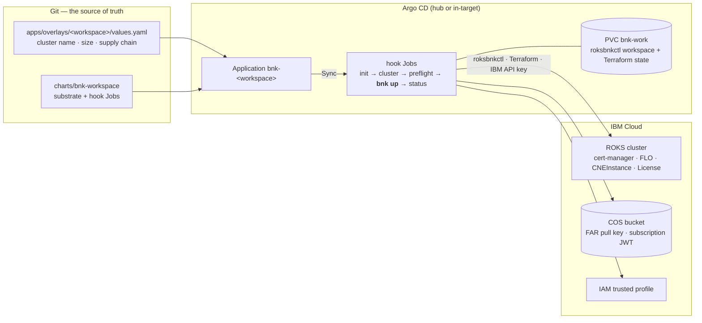

# What you are about to build

By the end of Part II you will have this running:

- **One Argo CD `Application` per BNK workspace.** Its source is a Helm chart in
  the companion repository plus a small values overlay: the size, and
  roksbnkctl's own `config.yaml` — the same file the roksbnkctl book
  documents — naming the cluster, the version and the supply chain. Syncing the
  Application *is* the install.
- **Argo CD runs the lifecycle as hook Jobs.** Each Job runs the
  `roksbnkctl-tools-runner` image — roksbnkctl, Terraform, Helm, kubectl/oc and
  the IBM Cloud CLI in one container — and the Jobs are ordered with Argo CD
  sync waves so that every guard runs before the long apply, and the apply runs
  before the status capture.
- **The workspace lives on a PersistentVolumeClaim.** roksbnkctl keeps its
  Terraform state and hand-off files under `/work/.roksbnkctl`; the claim is
  never pruned and never deleted with the Application, so a later `bnk down`
  finds what it needs.
- **The cluster ends up with BNK 2.4 installed:** cert-manager, the F5
  Lifecycle Operator (FLO), the `CNEInstance` that drives TMM, the licence CR
  reporting `Active`, and an IBM IAM trusted profile the CNE controller uses to
  talk to the VPC.
- **Application health tells you the truth.** A Lua health check reads a
  `bnk-status` ConfigMap the hooks write, so the Application shows
  *Healthy — "BNK deployed"*, *Progressing*, or *Degraded* with the reason a
  gate or the apply failed.

## What you will do, in order

| Step | Where | What happens |
|---|---|---|
| 1 | Argo CD UI + one script | Sign in; register the `bnk-status` health check, the `bnk` AppProject, a read-only deploy key for the repository, and the workspace's `bnk-secrets` |
| 2 | Git | Describe the workspace in `apps/overlays/<name>/values.yaml` and add an `Application` |
| 3 | Argo CD UI | **Sync** — watch the gates pass and `bnk-up` run |
| 4 | Argo CD UI | Read the `bnk-up` logs: plan, apply, licence activation |
| 5 | Argo CD UI / CLI | Verify: Application Healthy, `bnk-status`, pods on the cluster |
| 6 | Argo CD UI | Uninstall: set `lifecycle: down` and sync, or delete the Application |

## What it is not

It is not a re-implementation of the BNK install in YAML. The install is still
performed by roksbnkctl driving Terraform with your IBM Cloud API key — the same
code path that runs on a laptop — because the install includes things Argo CD
cannot express as Kubernetes objects: IBM IAM trusted profiles, downloads from
COS, Helm charts pulled from F5's registry, readiness gates on F5 custom
resources, and an admission-policy workaround that has to run *concurrently*
with the apply. Argo CD is the orchestrator, the approval gate, the audit
trail and the health view; roksbnkctl is the installer. The evaluation that led
to this split is in the repository's `EVALUATION.md`.
