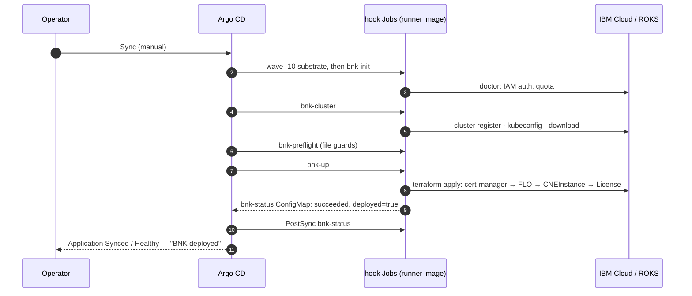

# How roksbnkctl runs under Argo CD

Argo CD syncs an `Application` in **phases** — `PreSync`, `Sync`, `PostSync`,
and `SyncFail` if anything went wrong — and within a phase it applies resources
in **waves**, waiting for each wave to become healthy before starting the next.
Any resource annotated `argocd.argoproj.io/hook` is a hook: a Kubernetes `Job`
that Argo CD creates, waits for, and treats as failed if the Job fails.

The `bnk-workspace` chart uses exactly that machinery:

```text
Sync     wave -10  Namespace · ServiceAccount · Role · RoleBinding · ConfigMap bnk-config (your config.yaml) · Secret bnk-secrets
Sync     wave  -4  PVC bnk-work          (shares the first hook's wave — see below)
Sync     wave  -4  bnk-init              init --config-file /config/config.yaml · doctor
Sync     wave  -3  bnk-cluster           cluster register <name>   |  cluster up --auto (hub)
Sync     wave  -2  bnk-registry          registry adopt | registry replicate   (only with a mirror)
Sync     wave  -1  bnk-preflight         workspace-file guards: mirror record, FLP hand-off, line change
Sync     wave   0  bnk-up                bnk up --auto  (+ cwc-guard container on BNK 2.3)    ← lifecycle: up
                   bnk-down              bnk down --auto                                      ← lifecycle: down
Sync     wave   0  ConfigMap bnk-status  written by the hooks; Lua health → Application health
PostSync wave   0  bnk-status            bnk status --json → ConfigMap bnk-status
SyncFail wave   0  bnk-syncfail          records which hook failed and why → Application Degraded
PreDelete          bnk-predelete         bnk down --auto when the Application is deleted (Argo CD ≥ 3.3)
```



## Why the gates are Sync-phase hooks, not PreSync

`PreSync` hooks run *before any regular resource is applied*. A PreSync Job
would start with no PVC, no ConfigMap, no Secret and no ServiceAccount, and hang
until its deadline. So the gates are `Sync` hooks at negative waves: the
substrate goes in at wave −10, the gates at −4…−1, the apply at 0. Within a
phase Argo CD interleaves hooks and resources by wave and waits for health, which
gives exactly the ordering above. A failed gate fails the sync before `bnk-up`
is ever created — you will see this in [Troubleshooting](12-troubleshooting.md).

## Why the PVC shares wave −4

Block storage classes (`ibmc-vpc-block-*` on ROKS, `local-path` on k3s, kind's
`standard`) bind **WaitForFirstConsumer**: the claim stays `Pending` until a pod
mounts it, and Argo CD reports a Pending claim as *Progressing* — and will not
leave a wave while a resource is Progressing. In its own wave the claim would
deadlock the sync. Sharing the first hook's wave makes `bnk-init`'s pod the
first consumer, and the claim binds inside that wave.

## Where the guards are

`bnk up` runs its own guards every time — registry mirror record, supported
line × network mode, create-time settings drift, "cluster already has BNK that
this workspace does not own", registry CA reachability from every node. The
`bnk-preflight` hook replicates the cheap, file-based ones so that a
misconfiguration fails the sync in seconds rather than minutes into the
Terraform apply. Nothing is skipped: the apply re-checks everything.

One rule the chart adds on top of roksbnkctl's: **BNK 2.3 and 2.4 have no
in-place upgrade**, so a manifest-version change against an installed
workspace is turned into `bnk down` followed by `bnk up` (or refused, by
`upgrade.strategy`). Terraform is never asked to mutate a running BNK into a
different version.

## Health, status and the "Apply this plan?" prompt

On a laptop, `bnk up` shows a Terraform plan and asks *Apply this plan?*. Under
Argo CD that prompt becomes the **Sync** button: the Application uses manual
sync, so nothing happens until someone with the `sync` permission presses it —
an audited action that an AppProject sync window can restrict to a maintenance
period.

The hooks write a `bnk-status` ConfigMap (`lifecycle`, `outcome`, `deployed`,
`message`, `status.json`). A small Lua health check registered in Argo CD maps
that to Application health:

| `outcome` | `deployed` | Application health |
|---|---|---|
| `running` | — | Progressing |
| `succeeded` | `true` (lifecycle up) / `false` (lifecycle down) | **Healthy** — "BNK deployed" / "BNK torn down" |
| `failed` | — | **Degraded** — the hook's message |
| `pending` | — | Healthy — "no bnk run recorded yet" |

The Application's `ignoreDifferences` on that ConfigMap's `data` (with
`RespectIgnoreDifferences=true`) keeps Argo CD from overwriting what the hooks
wrote on every sync.

## Topologies

- **In-target** — Argo CD (OpenShift GitOps, or upstream) runs on the ROKS
  cluster that receives BNK. The hook Jobs run there too. The cluster must
  already exist; `bnk-cluster` runs `cluster register`.
- **Hub** — Argo CD runs on a management cluster inside the IBM Cloud fabric
  (this book's screenshots come from a single-node k3s VSI, see
  [Appendix A](appendix-a-hub-vsi.md)). The hook Jobs reach the ROKS API over
  its public or private service endpoint and, if you use one, a Harbor mirror
  over a Transit Gateway. The hub is the only place `cluster up` from Git makes
  sense, and the only option for a cluster whose pods cannot reach IBM Cloud's
  public API endpoints.

Either way roksbnkctl authenticates to IBM Cloud with the API key in
`bnk-secrets` and fetches the cluster's admin kubeconfig itself; the pod's
ServiceAccount is only used to write the status ConfigMap.
