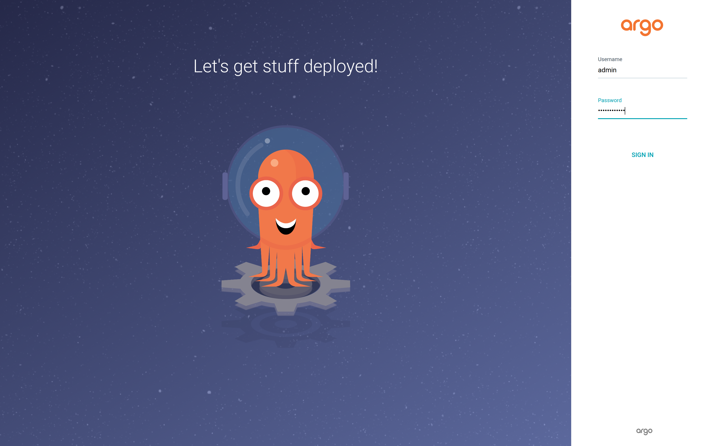
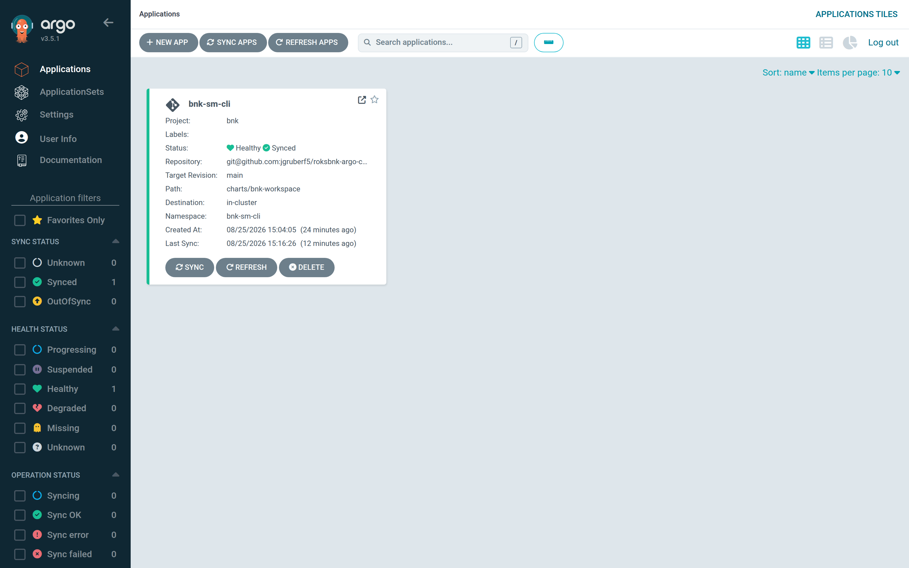
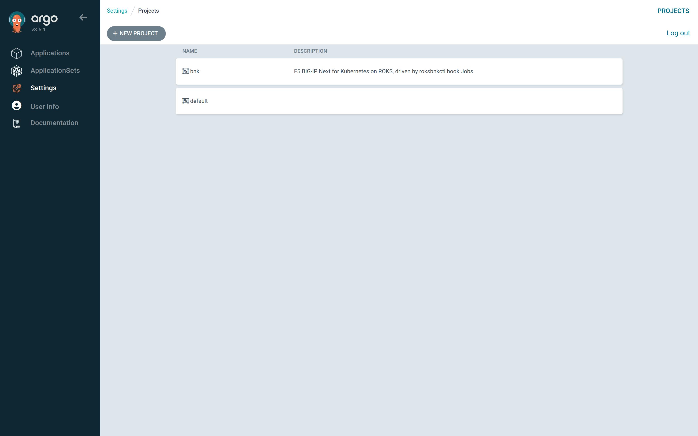
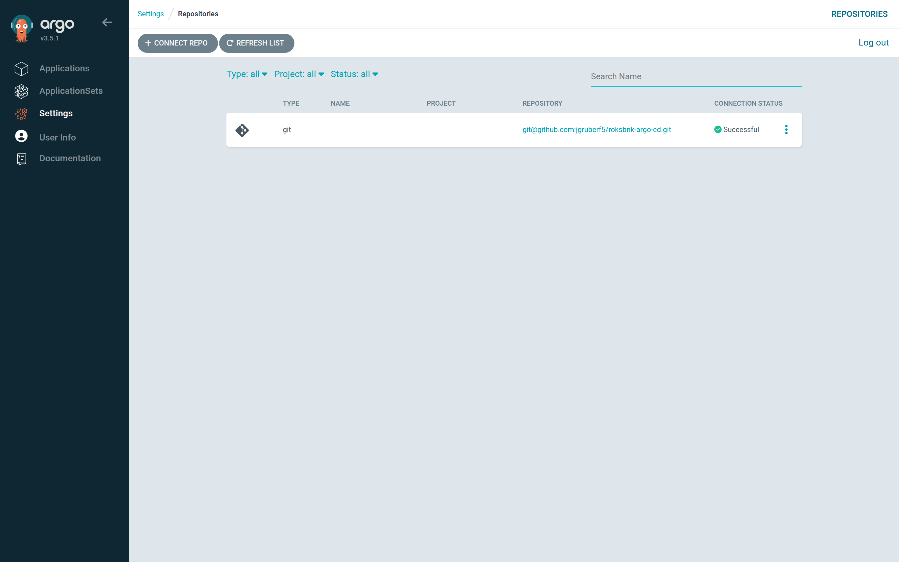

# Step 1 — Sign in and wire Argo CD

This step registers three things in Argo CD — the health check, the AppProject
and a credential for the Git repository — and creates the workspace's Secret.
Everything but the Secret is declarative and ships in `bootstrap/`. It is done
once per Argo CD instance; adding another workspace later only needs Step 2.

## Sign in

Open the Argo CD UI and sign in as a user who can manage projects and
repositories (`admin` is fine for the first time; its initial password is in
the `argocd-initial-admin-secret` Secret).



After sign-in you land on **Applications**. Nothing is there yet.



## Register the health check

Argo CD decides an Application's health from its resources. The chart writes a
`bnk-status` ConfigMap; a short Lua script turns it into
*Healthy — "BNK deployed"* / *Progressing* / *Degraded — reason*.

Upstream Argo CD — merge the key into `argocd-cm`:

```bash
kubectl apply -f bootstrap/upstream/argocd-cm-health.yaml
kubectl -n argocd rollout restart deploy/argocd-repo-server statefulset/argocd-application-controller
```

OpenShift GitOps — apply the `ArgoCD` CR fragment instead
(`spec.resourceHealthChecks`); the operator reconciles it:

```bash
kubectl apply -f bootstrap/openshift/argocd-cr.yaml
```

The check only looks at ConfigMaps labelled `roksbnkctl.io/status: "true"`;
every other ConfigMap stays Healthy, so it is invisible to other Applications.

## Create the AppProject

```bash
kubectl apply -n argocd -f bootstrap/appproject-bnk.yaml          # or -n openshift-gitops
```

`bnk` allows namespaced resources in `bnk-*` namespaces plus the `Namespace`
kind, and defines a `bnk-operator` role that may **get / sync / read logs** but
not edit Applications — pressing **Sync** is the production-change approval, so
it deserves its own role. Optionally uncomment the `syncWindows` block to
restrict syncs to a maintenance period.

**Settings → Projects** shows it:



## Connect the repository

Argo CD needs read access to the repository that holds the chart and your
overlays. This book uses a read-only deploy key on a private GitHub repository:

```bash
ssh-keygen -t ed25519 -N '' -f ~/.ssh/argocd-deploy-key -C argocd-readonly
gh repo deploy-key add ~/.ssh/argocd-deploy-key.pub -R <org>/roksbnk-argo-cd --title "argocd (read-only)"

kubectl -n argocd create secret generic repo-roksbnk-argo-cd \
  --from-literal=type=git \
  --from-literal=url=git@github.com:<org>/roksbnk-argo-cd.git \
  --from-file=sshPrivateKey=$HOME/.ssh/argocd-deploy-key --dry-run=client -o yaml \
  | kubectl label --local -f - argocd.argoproj.io/secret-type=repository -o yaml \
  | kubectl apply -f -
```

In the UI the same thing is **Settings → Repositories → Connect Repo** (SSH,
paste the private key). Either way it should show **Successful**:



## Create the workspace Secret

The runner needs the IBM Cloud API key — and nothing about it belongs in Git.
Create the namespace the Application will use and the Secret in it. Use
`printf`, not a here-string: a trailing newline makes IAM reject the key, and
the first sign of that is `doctor` failing in the `bnk-init` hook.

```bash
kubectl create namespace bnk-sm-cli
printf '%s' "$IBMCLOUD_API_KEY" | kubectl -n bnk-sm-cli create secret generic bnk-secrets \
  --from-file=IBMCLOUD_API_KEY=/dev/stdin
```

A registry-mirror password, a BIG-IP password or a GTM password go into the
same Secret under the key names listed in the [values reference](13-values-reference.md#storage-identity-secrets).
If you run
External Secrets Operator, set `secrets.mode: externalSecret` in the overlay and
let the chart render an `ExternalSecret` instead
(`bootstrap/external-secrets/` has a ClusterSecretStore for IBM Secrets
Manager).

> **Hub VSI users:** `hack/vsi/apply-hub.sh` performs every action on this page
> over ssh in one go — see [Appendix A](appendix-a-hub-vsi.md).
