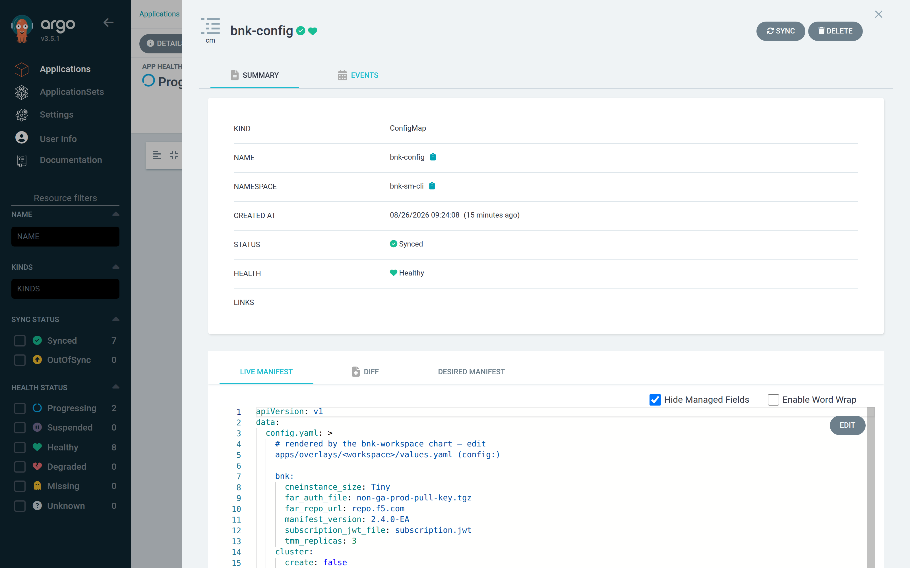
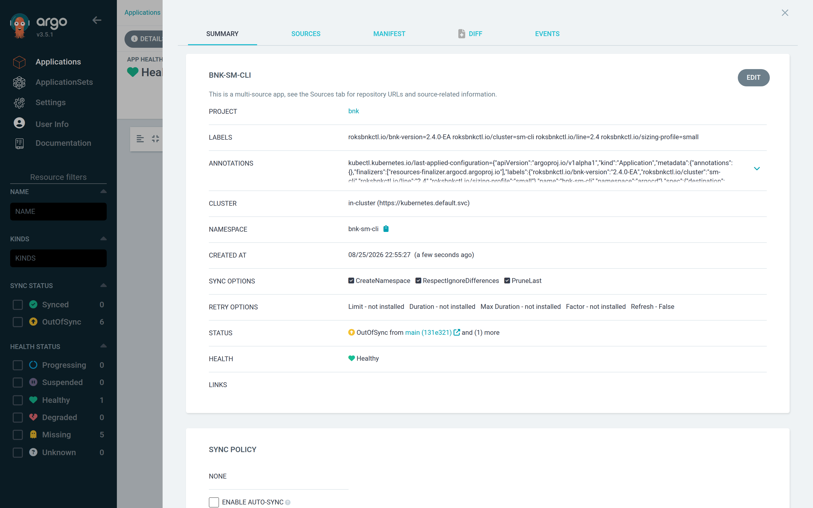
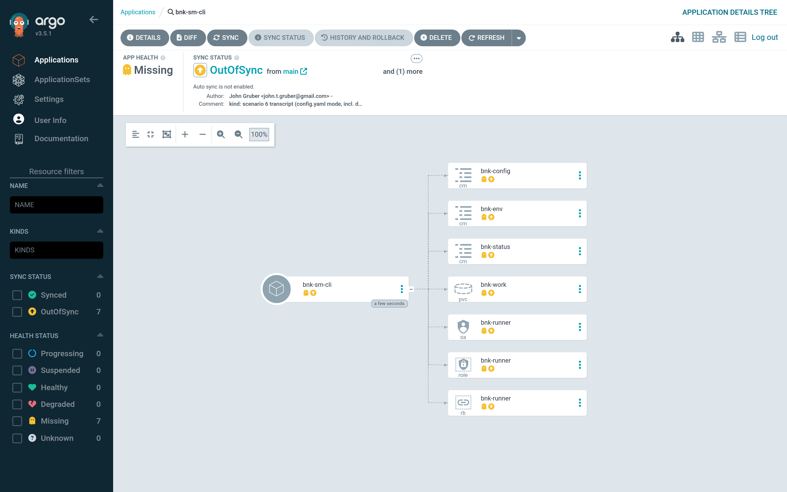

# Step 2 — Describe the workspace

A workspace is one BNK installation on one cluster. In Git it is one values
file and one `Application`. This chapter walks through the values file for the
cluster this book installs onto — `sm-cli`, an existing ROKS 4.21 cluster —
and explains what each block means.

## The size comes first

Before any other setting, decide the **cluster size**. F5's sizing guide
defines three; roksbnkctl has verified each on ROKS. Pick the row, and the
chart fills in the node count, the node flavour and the TMM pod count:

| `sizing.profile` | Worker nodes | Flavour | TMM pods | L4 ingress (F5 figure) |
|---|---|---|---|---|
| `small` | **6** (2 per zone) | **`bx2.8x32`** | 3 | ~7.8 Gbit/s |
| `medium` | **6** (2 per zone) | **`cx2.16x32`** | 3 | ~10.4 Gbit/s |
| `large` | **9** (3 per zone) | **`cx2.48x96`** | 9 | ~31 Gbit/s |
| `baseline` | 3 (1 per zone) | `bx2.16x64` | 1 | the BNK 2.4 install-guide shape |

> **`deploymentSize` is always `Tiny` on ROKS.** The words Small, Medium and
> Large above are cluster sizes. They are *not* the BNK `CNEInstance`
> `deploymentSize`, which accepts the same words but means something else — and
> on ROKS every value other than `Tiny` requests hugepages that ROKS workers
> cannot provide, so the install fails silently. Capacity comes from the number
> of TMM pods and the size of the nodes; the Large cluster runs nine `Tiny`
> TMMs on nine big nodes. The chart refuses to render any other
> `deploymentSize` on the 2.4 line (`sizing.allowNonTinyDeploymentSize` exists
> for people who have read this paragraph and disagree). [Chapter 9](09-sizing.md)
> has the full story.

`sm-cli` has six `bx2.8x32` workers, two per zone: it **is** the Small cluster.

## The values file

`apps/overlays/sm-cli/values.yaml` has two halves, and nothing appears in
both. The `config:` block is **roksbnkctl's own `config.yaml`**, verbatim:
the same schema `roksbnkctl init example` prints and the roksbnkctl
[config cheatsheet](https://jgruberf5.github.io/roksbnkctl/config-cheatsheet.html)
lists key by key — the cluster, the gateway, the BNK version, the supply chain. The chart
renders it into a ConfigMap, mounts it at `/config`, and the hooks read it
from there. Everything above it is Argo CD's concern only — things roksbnkctl
has no field for: which lifecycle verb to run, the size profile, the runner
image, storage, where the secrets come from, timeouts.

```yaml
workspace: sm-cli              # roksbnkctl workspace name
namespace: bnk-sm-cli          # where the hook Jobs and the PVC live
lifecycle: up                  # up = install (bnk up); down = uninstall (bnk down)
topology: hub                  # Argo CD on a management cluster; in-target if it runs on the ROKS cluster
sizing:
  profile: small               # 6× bx2.8x32, 3 TMM pods, deploymentSize Tiny — merged into config below

runner:
  tag: v1.59.1
  runAsUser: 1000              # k3s hub; leave unset on OpenShift
storage:
  size: 8Gi
  storageClassName: local-path # ibmc-vpc-block-10iops-tier on ROKS
secrets:
  mode: existing               # bnk-secrets was created in Step 1

config:                        # ← roksbnkctl config.yaml, as documented in the roksbnkctl book
  ibmcloud:
    region: us-east
    resource_group: default
  prefix: sm-cli
  tf_source:
    type: embedded
  cluster:
    create: false              # attach to an existing cluster (cluster register) …
    name: sm-cli               # … this one
    openshift_version: "4.21"
    network_mode: single-nic
  resources:
    transit_gateway:
      create: false
      existing: sm-cli-tgw     # the gateway the cluster VPC is already on
  bnk:
    manifest_version: 2.4.0-EA           # selects the 2.4 line; changing it later = upgrade (down, then up)
    far_repo_url: repo.f5.com
    far_auth_file: non-ga-prod-pull-key.tgz
    subscription_jwt_file: subscription.jwt
  cos:
    instance: bnk-supply-chain
    bucket: bnk-artifacts-0b5a00334eaf
    region: us-south
```

Block by block:

- **`lifecycle`** is the switch you will flip in Part IV. `up` renders a
  `bnk-up` hook; `down` renders `bnk-down` instead.
- **`sizing.profile`** is merged into `config` at render time:
  `cluster.workers_per_zone`, `cluster.worker_flavor`, `bnk.tmm_replicas` and
  `bnk.cneinstance_size: Tiny`. With `cluster.create: false` the first two
  describe the cluster you already have; `tmm_replicas` is what BNK uses.
- **`config.cluster`** — `create: false` + `name` means the `bnk-cluster` hook
  runs `cluster register sm-cli`, records the cluster's VPC, network mode and
  registry COS instance in `cluster-outputs.json`, and fetches the admin
  kubeconfig. `create: true` (hub only) runs `cluster up` and builds the
  cluster the size profile describes — that is how the `bnk-small`,
  `bnk-medium` and `bnk-large` overlays work.
- **`config.resources.transit_gateway`** — adopt the gateway by name or id
  (`create: false, existing: …`) or let the cluster phase create one.
- **`config.bnk`** — the version and the supply-chain object names;
  **`config.cos`** — the bucket they live in. Everything else in the
  roksbnkctl schema (`bnk.network.zones`, `bnk.flp`, `gateway:`, `state:` for
  the COS remote-state backend, …) goes in the same block.
- **Secrets never go in `config`.** The API key and any password come from
  the `bnk-secrets` Secret, which the init hook applies on top of the file.
  The chart refuses to render a `config` that contains `api_key_b64` or
  `*password_b64`.
- **Derived, not repeated.** The BNK line (2.3/2.4) comes from
  `config.bnk.manifest_version`; whether a registry-mirror hook runs comes from
  whether `config.registry` names a mirror; the registry COS instance is found
  by roksbnkctl's own naming (`<prefix>-registry-cos`). Each is a chart value
  you *can* set (`line`, `registry.mode`, `cluster.registryCosName`), but you
  should not need to.


## What the runner will see

Render it locally to check the `config.yaml` the hooks will get — this is what
Argo CD will show in the `bnk-config` ConfigMap's diff:

```bash
helm template bnk-sm-cli charts/bnk-workspace -f apps/overlays/sm-cli/values.yaml \
  | sed -n '/name: bnk-config/,/^---/p'
```

```yaml
data:
  config.yaml: |
    bnk:
      cneinstance_size: Tiny          # from sizing.profile
      far_auth_file: non-ga-prod-pull-key.tgz
      far_repo_url: repo.f5.com
      manifest_version: 2.4.0-EA
      subscription_jwt_file: subscription.jwt
      tmm_replicas: 3                 # from sizing.profile
    cluster:
      create: false
      name: sm-cli
      network_mode: single-nic
      openshift_version: "4.21"
      worker_flavor: bx2.8x32         # from sizing.profile
      workers_per_zone: 2             # from sizing.profile
    cos: {bucket: bnk-artifacts-0b5a00334eaf, instance: bnk-supply-chain, region: us-south}
    ibmcloud: {region: us-east, resource_group: default}
    prefix: sm-cli
    resources:
      transit_gateway: {create: false, existing: sm-cli-tgw}
    tf_source: {type: embedded}
```

Once the Application exists, the same file is what Argo CD shows for the
`bnk-config` resource — open it in the tree and read its **Summary** — and what a
later change to the overlay diffs against:



`make lint` runs `helm lint` over every overlay, and `make validate` checks the
rendered manifests against the Kubernetes and Argo CD schemas.

## The Application

`apps/sm-cli-application.yaml` points Argo CD at the chart and the overlay:

```yaml
apiVersion: argoproj.io/v1alpha1
kind: Application
metadata:
  name: bnk-sm-cli
  namespace: argocd
  labels:                                                # what this Application is, at a glance
    roksbnkctl.io/bnk-version: 2.4.0-EA
    roksbnkctl.io/line: "2.4"
    roksbnkctl.io/sizing-profile: small
    roksbnkctl.io/cluster: sm-cli
  finalizers: [resources-finalizer.argocd.argoproj.io]   # delete → PreDelete hook (bnk down) first
spec:
  project: bnk
  sources:
    - repoURL: git@github.com:jgruberf5/roksbnk-argo-cd.git
      targetRevision: main
      path: charts/bnk-workspace
      helm:
        releaseName: bnk-sm-cli
        valueFiles: ["$values/apps/overlays/sm-cli/values.yaml"]
    - repoURL: git@github.com:jgruberf5/roksbnk-argo-cd.git
      targetRevision: main
      ref: values
  destination:
    server: https://kubernetes.default.svc
    namespace: bnk-sm-cli
  ignoreDifferences:
    - kind: ConfigMap
      name: bnk-status
      jsonPointers: ["/data"]        # the hooks own the status
  syncPolicy:
    syncOptions: [CreateNamespace=true, RespectIgnoreDifferences=true, PruneLast=true]
    retry: {limit: 0}                # never re-run bnk up automatically
```

Commit the overlay and the Application, push, and apply the Application:

```bash
git add apps/overlays/sm-cli apps/sm-cli-application.yaml
git commit -m "sm-cli workspace" && git push
kubectl apply -f apps/sm-cli-application.yaml
```

The labels are the convention this book uses to tell Applications apart in
the UI: the BNK version, the line, the F5 cluster size and the target cluster.
Argo CD shows them on the Application, lets you filter the Applications list
by them (**Labels** filter, or `?labels=roksbnkctl.io/sizing-profile=small` in
the URL), and the chart stamps the same `roksbnkctl.io/*` labels on every
resource it renders, so `kubectl get all -l roksbnkctl.io/bnk-version=2.4.0-EA`
works on the hub too.

In a hand-written Application they repeat what the overlay says. The
ApplicationSet avoids that: its git-files generator reads each
`apps/overlays/*/values.yaml` and derives the name, namespace and labels from
`workspace`, `namespace`, `config.bnk.manifest_version`, `sizing.profile` and
`config.cluster.name` — the overlay is the only place those are written.



With the ApplicationSet applied instead (`apps/applicationset-workspaces.yaml`),
there is nothing to add: a new `apps/overlays/<name>/values.yaml` in Git is a
new Application.

The Application appears **OutOfSync** — Argo CD has rendered the chart and
listed every resource and hook it would create, but nothing is applied yet.
That is the starting line for Step 3.


