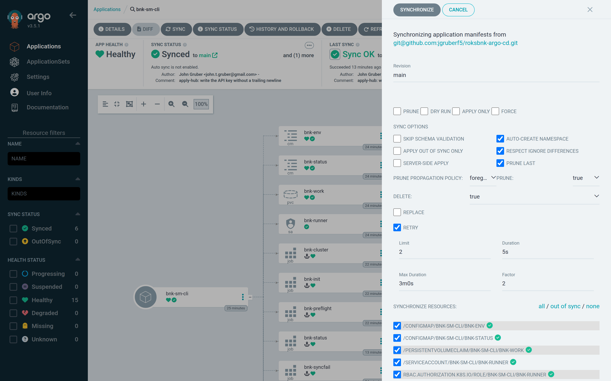
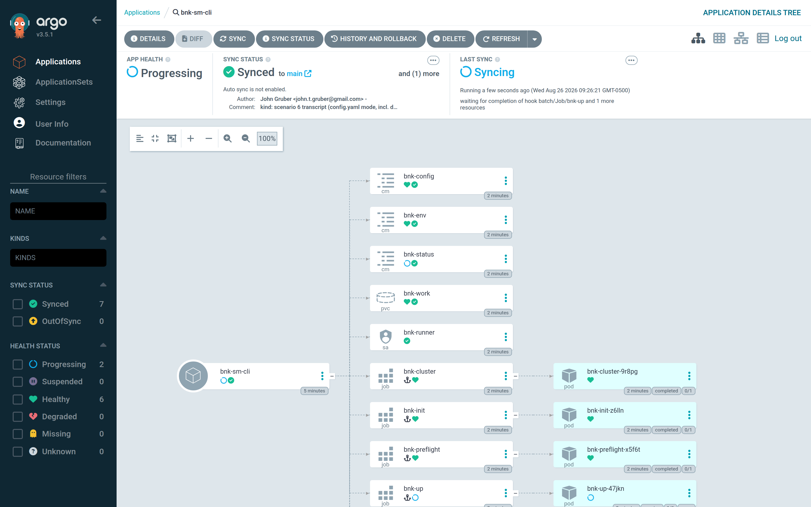
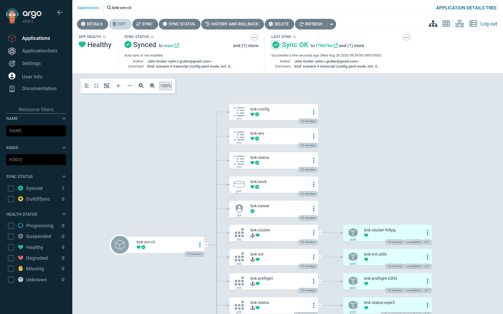

# Step 3 — Sync: install BNK

With the Application created, Argo CD has rendered the chart and knows what the
cluster *should* contain. Nothing has been applied. **Sync** is the moment the
install starts — it is the equivalent of answering *yes* to roksbnkctl's
"Apply this plan?" prompt, and because the Application uses manual sync, only
someone with the `sync` permission on the `bnk` project can press it.

## Press Sync

Open **Applications → bnk-sm-cli**. The tree shows the substrate — namespace
resources, the PVC, the ConfigMaps — and the hook Jobs as *OutOfSync /
Missing*. Click **Sync** in the top bar. The sync panel lists what will be
applied; leave the options at their defaults (the Application already carries
`CreateNamespace`, `RespectIgnoreDifferences` and `PruneLast`) and click
**Synchronize**.



From the CLI, the same action is:

```bash
argocd app sync bnk-sm-cli          # or, on the hub over ssh: argocd --core app sync bnk-sm-cli
```

## Watch the gates pass

The operation runs the waves described in [Chapter 2](02-how-it-works.md).
Each hook appears in the tree as it is created; a completed Job shows a green
tick, a running one a spinning icon, a failed one a red cross. The order is
always:

1. **`bnk-init`** (wave −4) — seeds the roksbnkctl workspace on the PVC from
   your `config.yaml` (the `bnk-config` ConfigMap, mounted at `/config`) plus
   the Secret, and runs `doctor`: tools present, the API key authenticates
   against IAM, VPC and Transit Gateway quota. Seconds.
2. **`bnk-cluster`** (wave −3) — `cluster register sm-cli`: looks the cluster
   up, verifies the registry COS instance, records `cluster-outputs.json`,
   confirms the VPC's Transit Gateway attachment, and downloads the admin
   kubeconfig onto the PVC. Under a minute.
3. **`bnk-preflight`** (wave −1) — the file guards: the workspace is
   initialised, the cluster is recorded, a configured mirror has a complete
   record, an FLP licence mode has its hand-off, and the BNK line has not
   changed under an applied workspace. Seconds.
4. **`bnk-up`** (wave 0) — the install itself. On a cluster that has never
   seen BNK this is 45–90 minutes: cert-manager, then the F5 Lifecycle
   Operator, then the `CNEInstance` (TMM), then the licence, each with a
   readiness gate. On `sm-cli`, which had been installed and torn down earlier
   the same day and still had every image cached on its nodes, it took eight
   minutes.
5. **`bnk-status`** (PostSync) — captures `bnk status --json` into the
   `bnk-status` ConfigMap.

While `bnk-up` runs, the tree shows the gates completed and the apply in
progress — the Application is *Progressing*, the operation *Syncing*:



If any gate fails, the sync stops there: `bnk-up` is never created, the
`bnk-syncfail` hook records which Job failed and why, and the Application turns
**Degraded** with that message. [Troubleshooting](12-troubleshooting.md) shows
what that looks like.

## The finished picture

When the operation completes the Application is **Synced** and **Healthy**, and
hovering the heart icon (or opening `bnk-status`) shows *BNK deployed* with the
timestamp of the run:



Every hook Job is still in the tree. Argo CD's hook-delete policy is
`BeforeHookCreation`: a Job — and its logs — stays until the next sync replaces
it, so you can open any of them now. That is the next step.

## What was created on the cluster

`bnk up` applied 37 Terraform resources:

- the `cert-manager` namespace and Helm release (`v1.17.3`);
- namespaces `f5-bnk` and `f5-utils`, the FAR pull secret in each, the
  `f5-bigip-ctlr-login` secret, a self-signed cert-manager issuer chain and the
  `ens3-ipvlan-l2` NetworkAttachmentDefinition;
- the F5 Lifecycle Operator Helm release (`flo`) — its chart pulled from
  `repo.f5.com` with the FAR key downloaded from your COS bucket — and the
  `CNEManifest` that pins every BNK image to the manifest version;
- the privileged SCC binding FLO needs;
- the `CNEInstance` (`deploymentSize: Tiny`, `tmmReplicas: 3`) and the wait for
  `CNEControllerAvailable`;
- the `License` CR carrying the subscription JWT (also from COS), the wait for
  `status.state: Active`, and finally the 2.4 aggregate `Available=True` gate;
- on IBM Cloud, an IAM trusted profile for the CNE controller, linked to its
  ServiceAccount, with Viewer/Editor on the VPC and Viewer on the cluster.

The runner's own workspace — `config.yaml`, `cluster-outputs.json`, the
Terraform state and the `terraform.applied.tfvars` snapshot — is on the
`bnk-work` PVC, which is exactly what the uninstall in Part IV will read.
