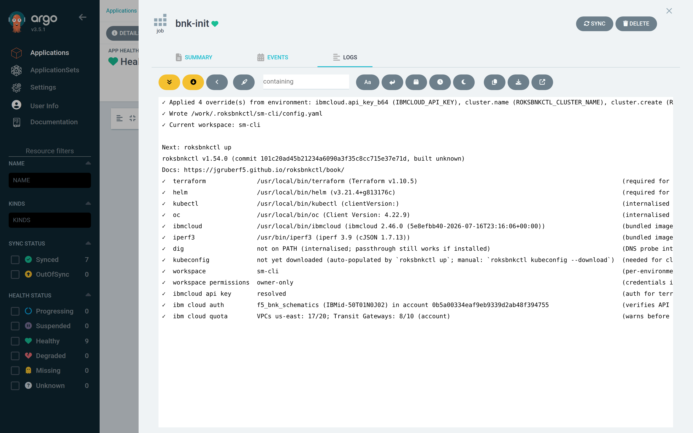
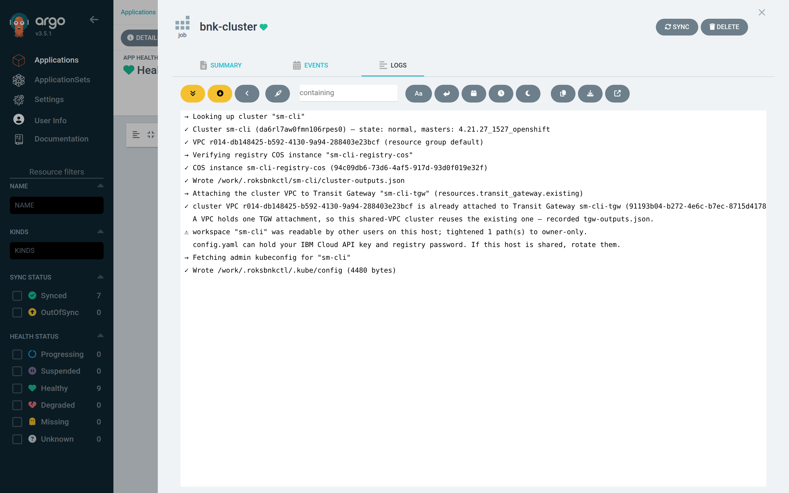
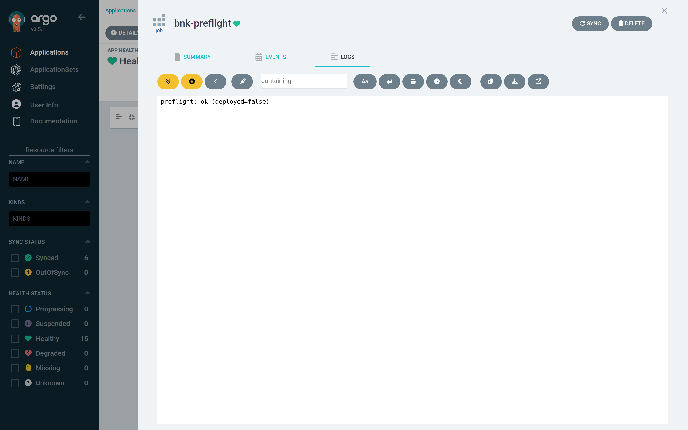
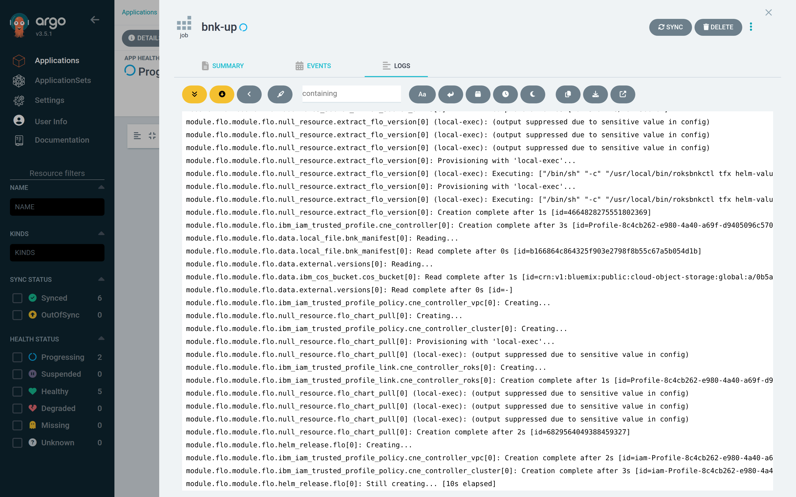
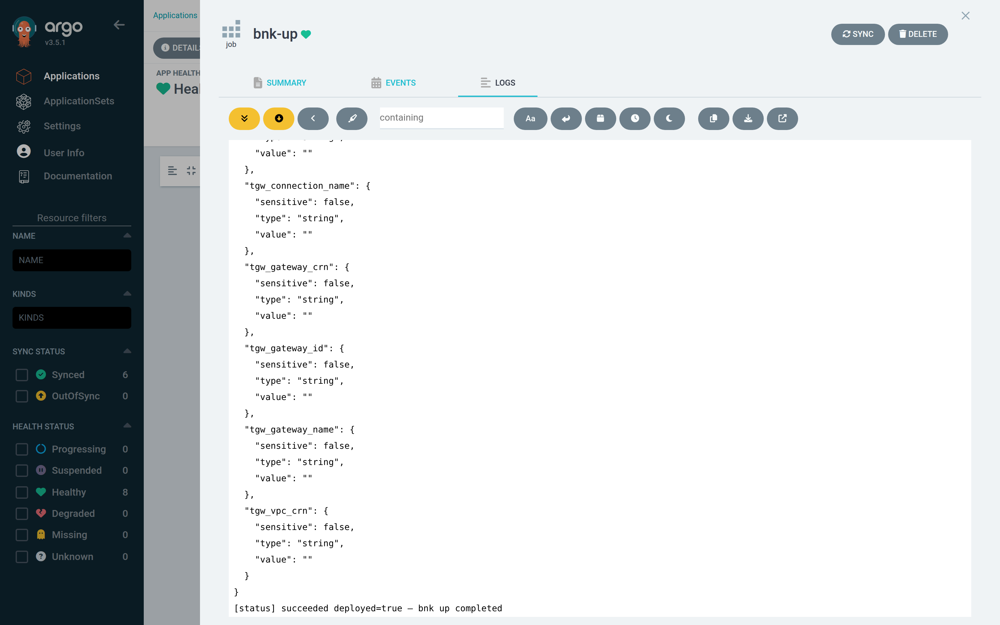
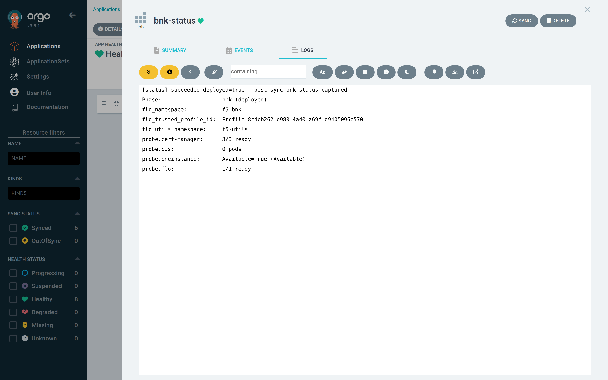

# Step 4 — Read the logs of bnk up

Every hook Job's output is available in the Argo CD UI: click the Job in the
tree, then the **Logs** tab in the sliding panel. The URL is bookmarkable —
`…/applications/argocd/bnk-sm-cli?view=tree&node=batch/Job/bnk-sm-cli/bnk-up/0&tab=logs`
— and the CLI equivalent is `kubectl -n bnk-sm-cli logs job/bnk-up`.

## bnk-init: the workspace and doctor



```text
✓ Applied 17 field(s) from environment: ibmcloud.api_key_b64 (IBMCLOUD_API_KEY), prefix (ROKSBNKCTL_PREFIX),
  ibmcloud.region (ROKSBNKCTL_REGION), … cluster.name (ROKSBNKCTL_CLUSTER_NAME), … bnk.cneinstance_size
  (ROKSBNKCTL_CNEINSTANCE_SIZE), … tmm_replicas (ROKSBNKCTL_TMM_REPLICAS), resources.transit_gateway.existing
  (ROKSBNKCTL_TRANSIT_GATEWAY_NAME), bnk.manifest_version (ROKSBNKCTL_MANIFEST_VERSION), …
✓ Wrote /work/.roksbnkctl/sm-cli/config.yaml (non-interactive, from environment)
roksbnkctl v1.54.0 (commit 101c20a…)
✓  terraform              /usr/local/bin/terraform (Terraform v1.10.5)
✓  helm                   /usr/local/bin/helm (v3.21.4)
✓  ibmcloud api key       resolved
✓  ibm cloud auth         f5_bnk_schematics (IBMid-…) in account 0b5a…
✓  ibm cloud quota        VPCs us-east: 17/20; Transit Gateways: 8/10 (account)
```

The first line is the whole point of `bnk-env`: every setting reached the
runner, and it says which key set which field. The `ibm cloud auth` line is the
one to look for when a run fails immediately — an invalid or mistyped key fails
here, in seconds, before anything touches the cluster.

## bnk-cluster: register the cluster



```text
→ Looking up cluster "sm-cli"
✓ Cluster sm-cli (da6rl7aw0fmn106rpes0) — state: normal, masters: 4.21.27_1527_openshift
✓ VPC r014-db148425-b592-4130-9a94-288403e23bcf (resource group default)
→ Verifying registry COS instance "sm-cli-registry-cos"
✓ COS instance sm-cli-registry-cos (94c09db6-…)
✓ Wrote /work/.roksbnkctl/sm-cli/cluster-outputs.json
→ Attaching the cluster VPC to Transit Gateway "sm-cli-tgw" (resources.transit_gateway.existing)
✓ cluster VPC r014-db148425-… is already attached to Transit Gateway sm-cli-tgw as connection "sm-cli-cluster-vpc".
  A VPC holds one TGW attachment, so this shared-VPC cluster reuses the existing one — recorded tgw-outputs.json.
→ Fetching admin kubeconfig for "sm-cli"
✓ Wrote /work/.roksbnkctl/.kube/config
```

## bnk-preflight: the gates



```text
preflight: ok (deployed=false)
```

Short when everything is right. When it is not, the message names the guard —
`registry mirror incomplete: 3 artifacts missing`, `license_mode=f5licenseproxy
but no FLP hand-off`, `BNK line change 2.3 -> 2.4 is refused on an applied
workspace` — and the sync stops before `bnk-up` exists.

## bnk-up: plan, apply, gates

This is the log to read. It is long — 3,500 lines for `sm-cli` — because it is
Terraform's own output plus roksbnkctl's guards and post-apply steps. The UI
streams it live while the Job runs (the **follow** toggle is on by default):



…and keeps it after the Job completes, scrolled here to the end:



The shape of it, with the lines worth recognising:

```text
[status] running deployed=unknown — bnk up in progress
✓ Cluster sm-cli (da6rl7aw0fmn106rpes0) — state: normal, masters: 4.21.27_1527_openshift
✓ COS instance sm-cli-registry-cos (…)
✓ cluster VPC … is already attached to Transit Gateway sm-cli-tgw …

Terraform will perform the following actions:
  # module.cert_manager.module.cert_manager.helm_release.cert_manager[0] will be created
  # module.flo.module.flo.helm_release.flo[0] will be created
  …
Plan: 37 to add, 0 to change, 0 to destroy.

module.cert_manager.module.cert_manager.kubernetes_namespace_v1.cert_manager[0]: Creation complete after 0s [id=cert-manager]
module.cert_manager.module.cert_manager.helm_release.cert_manager[0]: Creating...
module.cert_manager.module.cert_manager.helm_release.cert_manager[0]: Still creating... [1m20s elapsed]
module.cert_manager.module.cert_manager.helm_release.cert_manager[0]: Creation complete after 1m27s [id=cert-manager]
module.flo.module.flo.kubernetes_namespace_v1.flo[0]: Creation complete after 1s [id=f5-bnk]
module.flo.module.flo.kubernetes_namespace_v1.f5_utils[0]: Creation complete after 1s [id=f5-utils]
module.flo.module.flo.ibm_iam_trusted_profile.cne_controller[0]: Creating...
module.flo.module.flo.kubectl_manifest.selfsigned_issuer[0]: Creation complete … [id=/apis/cert-manager.io/v1/clusterissuers/selfsigned-cluster-issuer]
module.flo.module.flo.kubectl_manifest.nad_ens3[0]: Creation complete … [id=…/networkattachmentdefinitions/ens3-ipvlan-l2]
module.flo.module.flo.null_resource.far_archive_download[0]: Creation complete        ← the FAR pull key, from COS
module.flo.module.flo.null_resource.cne_far_tgz_extractor[0]: Creation complete
module.flo.module.flo.null_resource.extract_flo_version[0]: …                         ← the manifest chart, from repo.f5.com
module.flo.module.flo.helm_release.flo[0]: Creation complete …
module.flo.module.flo.kubectl_manifest.cne_manifest[0]: Creation complete …
module.cne_instance.module.cneinstance.kubectl_manifest.cneinstance[0]: Creation complete …
module.cne_instance.module.cneinstance.null_resource.cnecontroller_ready[0]: Still creating... [1m0s elapsed]   ← waits for CNEControllerAvailable=True
module.license.module.license.kubectl_manifest.license[0]: Creation complete …
module.license.module.license.null_resource.license_active[0]: Creation complete after 38s      ← License status.state=Active
module.license.module.license.null_resource.cneinstance_available_24[0]: Creation complete after 2m5s   ← 2.4 aggregate Available=True

Apply complete! Resources: 37 added, 0 changed, 0 destroyed.

✓ Wrote kubeconfig to /work/.roksbnkctl/.kube/config
✓ Wrote cert kubeconfig to /work/.roksbnkctl/forge/kubeconfig.yaml (for BNK Forge registration)
[status] succeeded deployed=true — bnk up completed
```

Three things to notice:

- **The readiness gates are inside the apply.** `cnecontroller_ready`,
  `license_active` and `cneinstance_available_24` are `null_resource`s whose
  local-exec polls the F5 custom resources (`roksbnkctl tfx wait`). If the
  controller never becomes Available or the licence never goes Active, the
  apply fails there — with a fifteen-minute timeout — and the Job fails with
  it.
- **`(output suppressed due to sensitive value in config)`** is Terraform
  hiding the kube token those provisioners receive. It is not an error.
- **The last line is the status write.** `bnk-up`'s trap writes `succeeded`
  with `deployed=true` on success, or `failed` with the exit status on any
  error, and that is what the Application's health reflects a few seconds
  later.

## bnk-status: the PostSync capture



```text
[status] succeeded deployed=true — post-sync bnk status captured
Phase:                   bnk (deployed)
flo_namespace:           f5-bnk
flo_trusted_profile_id:  Profile-decf78f4-d511-442d-9c38-3b58ff4405bd
flo_utils_namespace:     f5-utils
```

## Getting the full log out

```bash
kubectl -n bnk-sm-cli logs job/bnk-up > bnk-up.log             # the whole thing
kubectl -n bnk-sm-cli logs -l roksbnkctl.io/workspace=sm-cli --tail=200   # every hook, last 200 lines each
```

The Jobs survive until the next sync. If you need the logs to outlive that,
ship them from the hub cluster to your log stack, or run `roksbnkctl journal`
in the workspace — the PVC is the durable place.
