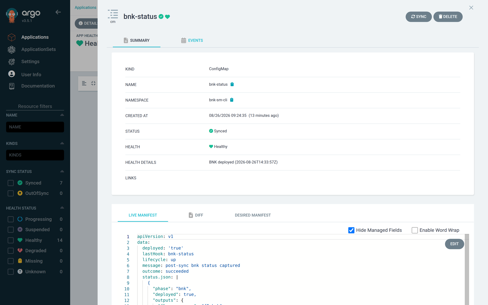

# Step 5 — Verify the deployment

Three layers, from the outside in.

## 1. Application health

**Applications → bnk-sm-cli** shows *Synced* and *Healthy*. The health comes
from the `bnk-status` ConfigMap; open it in the tree to see what the hooks
recorded:



The live manifest below the summary shows the raw data — `lifecycle`,
`outcome`, `deployed`, `message`, `updatedAt`, which hook wrote it last, and
the full `bnk status --json` document.

```bash
kubectl -n bnk-sm-cli get configmap bnk-status -o jsonpath='{.data.outcome} {.data.deployed} {.data.message}{"\n"}'
# succeeded true post-sync bnk status captured
```

## 2. roksbnkctl's own view

`bnk status` runs in the PostSync hook (its output is in the `bnk-status`
Job's logs, Step 4). To run it yourself against the same workspace, exec into a
runner pod with the PVC mounted, or — simpler — run the same image with the
workspace's ConfigMap and Secret:

```bash
kubectl -n bnk-sm-cli create job --from=job/bnk-status bnk-status-manual
kubectl -n bnk-sm-cli logs -f job/bnk-status-manual
```

It reports the phase, the FLO namespaces, the trusted profile id, and — once
the kubeconfig on the PVC is used — the per-component readiness probe.

## 3. On the ROKS cluster

Use any kubeconfig for `sm-cli` (`ibmcloud ks cluster config --cluster sm-cli
--admin`, or the one on the PVC):

```bash
oc get pods -n f5-bnk
oc get pods -n f5-utils
oc get cneinstance -n f5-bnk -o jsonpath='{.items[0].status.conditions}' | jq
oc get licenses.k8s.f5net.com -n f5-utils bnk-license -o jsonpath='{.status.state}{"\n"}'   # Active
oc get pods -n f5-bnk -l app=f5-tmm -o wide                                                # 3 TMM pods, one per zone
```

What "done" looks like on a Small cluster: every pod in `f5-bnk` and
`f5-utils` `Running`/`Completed`, the `CNEInstance` reporting `Available=True`,
`bnk-license` `Active`, and three `f5-tmm` pods spread across the three
availability zones. The `roksbnkctl test` suite (connectivity, DNS,
throughput) is documented in the roksbnkctl book and runs from the same
workspace.

## Re-syncing is safe

Press **Sync** again and every hook runs again: `init` rewrites the same
`config.yaml`, `cluster register` finds the same cluster, the preflight passes,
and `bnk up` runs `terraform plan` again. Expect a small plan, not an empty
one: roksbnkctl's readiness gates are `null_resource`s whose triggers change on
every run, so a handful are replaced and the FLO release is re-applied with the
same values (a re-sync on the workspace above reported `2 to add, 6 to change,
2 to destroy` and finished in six minutes). No BNK pod restarts. That is the
idempotency the whole design relies on, and it is how you apply a changed
setting: edit the overlay, commit, sync.
