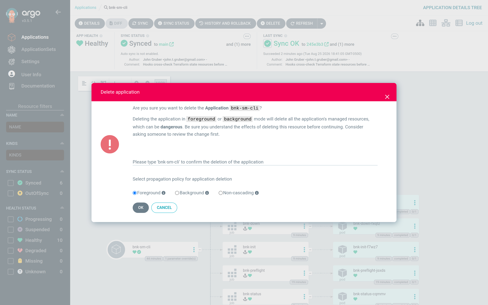

# Step 6 — Tear BNK down

There are two ways to uninstall, and they answer two different questions.

| | Keep the Application | Delete the Application |
|---|---|---|
| What it does | Runs `bnk down` and leaves the workspace in place, *Healthy — "BNK torn down"* | Runs `bnk down` as a PreDelete hook, then removes every resource the Application manages |
| The ROKS cluster | untouched | untouched — unless the overlay set `cluster.create: true` **and** `teardown.cluster: true` |
| The PVC (Terraform state) | kept | kept (`Delete=false`) |
| Re-install | set `lifecycle` back to `up`, **Sync** | re-create the Application, **Sync** — it finds its state on the PVC |
| Needs Argo CD | any version | ≥ 3.3 (PreDelete hooks) |

For `sm-cli`, which was *registered* rather than built, both leave the cluster
running with BNK removed from it.

## Option A — keep the Application: `lifecycle: down`

The chart renders a `bnk-down` hook instead of `bnk-up` when `lifecycle` is
`down`. Flip it in Git — the durable, reviewable way:

```yaml
# apps/overlays/sm-cli/values.yaml
lifecycle: down
```

```bash
git commit -am "sm-cli: tear BNK down" && git push
```

…or, entirely from the UI, override the Helm value on the Application. This
is a *multi-source* Application (the chart and the values overlay are two
sources), so the Helm values live under **Details → Sources**: open
**Applications → bnk-sm-cli → Details**, choose the **Sources** tab, expand
the `charts/bnk-workspace` source, click **Edit** next to its parameters, add
`lifecycle` = `down`, **Save**. Argo CD stores the override in the Application
spec (`spec.sources[0].helm.parameters`); a later Git change to the overlay
will not undo it until you remove the override.


The same override from the CLI, which is what this book's captures used:

```bash
kubectl -n argocd patch application bnk-sm-cli --type json \
  -p '[{"op":"add","path":"/spec/sources/0/helm/parameters","value":[{"name":"lifecycle","value":"down"}]}]'
```

Either way the Application shows **OutOfSync** — the desired state now
contains `bnk-down`:


Click **Sync → Synchronize**. Only `bnk-init` and `bnk-down` run — the
cluster, registry and preflight gates are skipped, because the state they
would produce is already on the PVC. Open **bnk-down → Logs**:


```text
[status] running deployed=unknown — bnk down in progress
…
Plan: 0 to add, 0 to change, 37 to destroy.
module.license.module.license.null_resource.cneinstance_available_24[0]: Destroying...
module.license.module.license.kubectl_manifest.license[0]: Destroying...
…
module.cne_instance.module.cneinstance.kubectl_manifest.cneinstance[0]: Destruction complete
module.flo.module.flo.helm_release.flo[0]: Destruction complete
module.flo.module.flo.ibm_iam_trusted_profile.cne_controller[0]: Destruction complete
module.cert_manager.module.cert_manager.helm_release.cert_manager[0]: Destruction complete
Destroy complete! Resources: 37 destroyed.
[status] succeeded deployed=false — bnk down completed
```

`bnk down` tears the phases down in reverse-dependency order, then sweeps the
things Terraform cannot see: F5's validating webhook, the licence secrets in
the utils namespace, and any finalizer that would leave the `f5-bnk` namespace
stuck. Custom resource definitions are deliberately left in place. On
`sm-cli`, the destroy took just under six minutes.

When it finishes the Application is **Synced / Healthy — "BNK torn down"**,
with `bnk-status` showing `lifecycle=down outcome=succeeded deployed=false`:


To install again, set `lifecycle: up` and **Sync**.

## Option B — delete the Application

**Applications → bnk-sm-cli → Delete**. Keep the propagation policy at
**Foreground** (the default; *Non-cascading* would orphan the resources and skip
the hook) and confirm with the Application's name:



Because the Application carries the `resources-finalizer.argocd.argoproj.io`
finalizer and the chart renders a `PreDelete` hook, Argo CD:

1. creates `bnk-predelete`, which runs `bnk down --auto` (and, when the
   overlay built the cluster with `teardown.cluster: true`, `tgw disconnect`
   and `cluster down`);
2. waits for it to finish — the Application stays visible, "Deleting", for the
   duration;
3. deletes the namespace resources, skipping the PVC.

The PreDelete Job is removed together with the Application, so its logs are
not retained in Argo CD; the evidence is in the namespace events and on the
PVC. If you want the teardown log, use Option A first and delete afterwards.

From the CLI:

```bash
argocd app delete bnk-sm-cli            # foreground cascade → PreDelete hook
```

## Which one to use

- Tearing BNK down to re-install it, upgrade it, or change a create-time
  setting: **Option A**. The Application stays as the record of what was done.
- Decommissioning the workspace: **Option A, then Option B** — you get the
  destroy log, and then the namespace is cleaned up.
- A cluster you built from Git (`bnk-small`, `bnk-medium`, `bnk-large`):
  **Option B** with `teardown.cluster: true` removes BNK, the cluster, its
  gateway connection and VPC in one PreDelete hook.

## What is left behind, on purpose

- The `bnk-work` PVC with the workspace and its `terraform.applied.tfvars`
  snapshot (roksbnkctl keeps the snapshot after a destroy, so a later
  `bnk up` can detect a line change).
- BNK's CustomResourceDefinitions on the cluster.
- The COS supply-chain bucket and the registry COS instance.
