# Step 6 — Tear BNK down

There are two ways to uninstall, and they answer two different questions.

| | Keep the Application | Delete the Application |
|---|---|---|
| What it does | Runs `bnk down` and leaves the workspace in place, *Healthy — "BNK torn down"* | Runs `bnk down` as a PreDelete hook, then removes every resource the Application manages |
| The ROKS cluster | untouched | untouched — unless the overlay set `cluster.create: true` **and** `teardown.cluster: true` |
| The PVC (Terraform state) | kept | kept (`Delete=false`) |
| Re-install | set `lifecycle` back to `up`, **Sync** | re-create the Application, **Sync** — it finds its state on the PVC |
| Needs Argo CD | any version | ≥ 3.3 (PreDelete hooks) |

For `sm-cli`, which was *registered* rather than built, both leave the cluster
running with BNK removed from it.

## Option A — keep the Application: `lifecycle: down`

The chart renders a `bnk-down` hook instead of `bnk-up` when `lifecycle` is
`down`. Flip it in Git — the durable, reviewable way:

```yaml
# apps/overlays/sm-cli/values.yaml
lifecycle: down
```

```bash
git commit -am "sm-cli: tear BNK down" && git push
```

…or, entirely from the UI, override the Helm value on the Application. This
is a *multi-source* Application (the chart and the values overlay are two
sources), so the Helm values live under **Details → Sources**: open
**Applications → bnk-sm-cli → Details**, choose the **Sources** tab, expand
**Source 1** (`PATH=charts/bnk-workspace`), click **Edit** in its **Helm**
section, set the `lifecycle` parameter to `down`, **Save**. The override shows
in the Parameters list with a wrench icon, and the Application card gains a
"1 parameter override(s)" badge. Argo CD stores the override in the Application
spec (`spec.sources[0].helm.parameters`); a later Git change to the overlay
will not undo it until you remove the override.

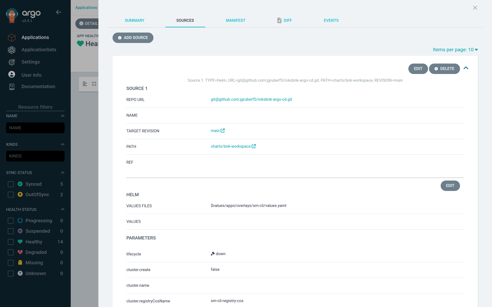

The same override from the CLI, which is what this book's captures used:

```bash
kubectl -n argocd patch application bnk-sm-cli --type json \
  -p '[{"op":"add","path":"/spec/sources/0/helm/parameters","value":[{"name":"lifecycle","value":"down"}]}]'
```

Either way the Application shows **OutOfSync** — the desired state now
contains `bnk-down`:

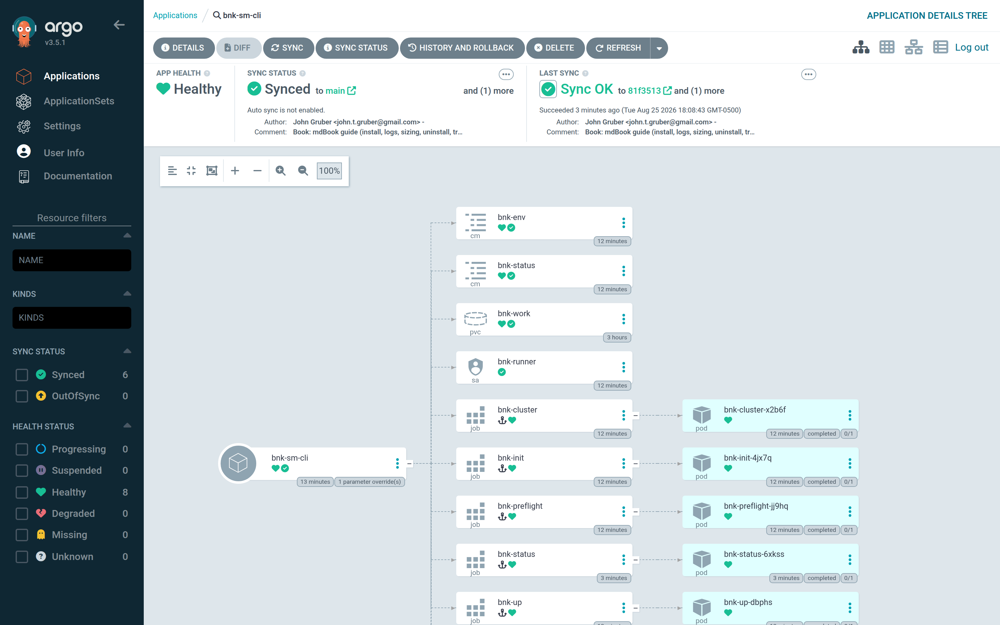

Click **Sync → Synchronize**. Only `bnk-init` and `bnk-down` run — the
cluster, registry and preflight gates are skipped, because the state they
would produce is already on the PVC. While the destroy runs the tree shows
`bnk-down` in progress and the Application *Progressing*:

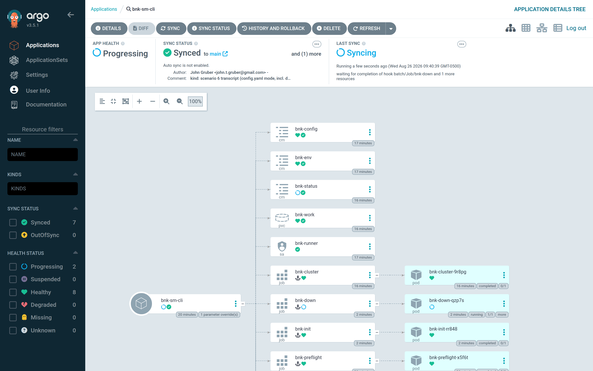

Open **bnk-down → Logs** to follow the destroy live…

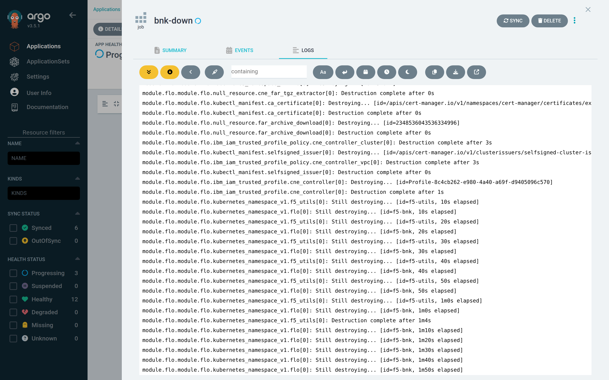

…and after it completes:

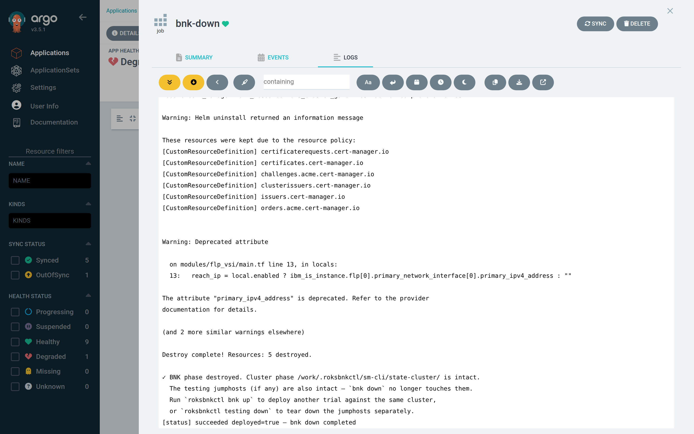

```text
[status] running deployed=unknown — bnk down in progress
…
Plan: 0 to add, 0 to change, 37 to destroy.
module.license.module.license.null_resource.cneinstance_available_24[0]: Destroying...
module.license.module.license.kubectl_manifest.license[0]: Destroying...
…
module.cne_instance.module.cneinstance.kubectl_manifest.cneinstance[0]: Destruction complete
module.flo.module.flo.helm_release.flo[0]: Destruction complete
…
Error: context deadline exceeded
  ⚠ namespace "f5-bnk" was stuck Terminating; cleared F5 finalizers on 2 object(s) and it drained.
→ terraform destroy (retry, after freeing the stuck namespace)
Plan: 0 to add, 0 to change, 5 to destroy.
module.flo.module.flo.ibm_iam_trusted_profile.cne_controller[0]: Destruction complete
module.cert_manager.module.cert_manager.helm_release.cert_manager[0]: Destruction complete
Destroy complete! Resources: 5 destroyed.
✓ BNK phase destroyed. Cluster phase /work/.roksbnkctl/sm-cli/state-cluster/ is intact.
[status] succeeded deployed=false — bnk down completed
```

That log is what happens on every BNK 2.4 teardown today: Terraform deletes
the `CNEInstance` without waiting for its finalizers, removes the F5 Lifecycle
Operator three seconds later, and the `f5-bnk` namespace then cannot finish
terminating because the controller that would clear two F5 custom resources
is gone. After the kubernetes provider's five-minute timeout roksbnkctl clears
those finalizers, watches the namespace drain, and re-runs the destroy for the
five resources that were left. Nothing for the operator to do — but it is
worth recognising in the log rather than mistaking the first `Error:` for a
failure. (The ordering fix belongs in roksbnkctl's Terraform and is tracked in
the repository's roadmap.)

`bnk down` tears the phases down in reverse-dependency order, then sweeps the
things Terraform cannot see: F5's validating webhook, the licence secrets in
the utils namespace, and any finalizer that would leave the `f5-bnk` namespace
stuck. Custom resource definitions are deliberately left in place. On
`sm-cli`, the destroy took just under six minutes.

When it finishes the Application is **Synced / Healthy — "BNK torn down"**,
with `bnk-status` showing `lifecycle=down outcome=succeeded deployed=false`:

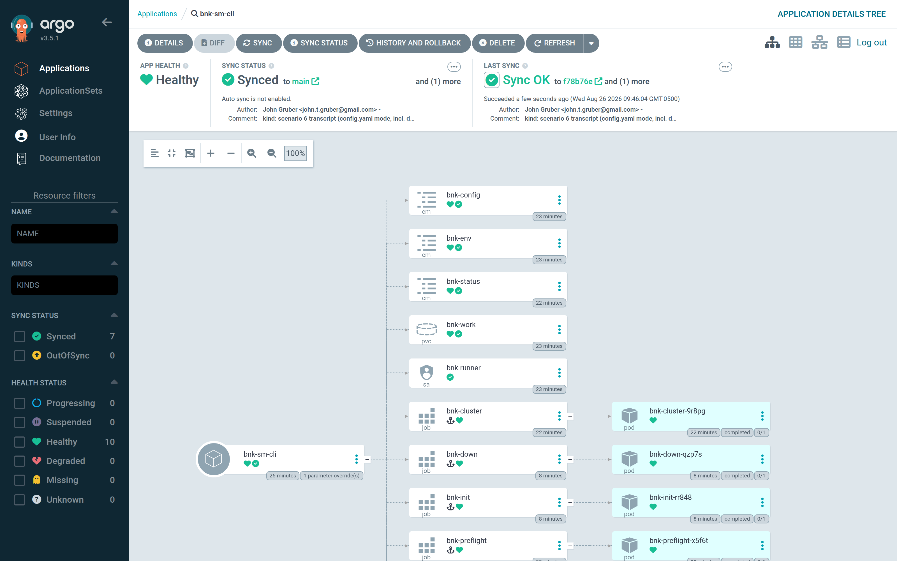

To install again, set `lifecycle: up` and **Sync**.

## Option B — delete the Application

**Applications → bnk-sm-cli → Delete**. The dialog asks you to type the
Application's name and to choose a propagation policy. Keep **Foreground**
(the default): *Non-cascading* would orphan the resources and skip the hook.

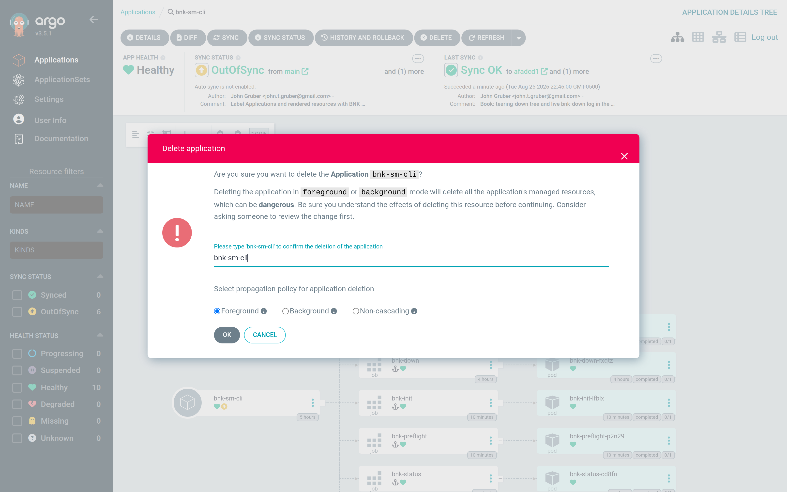

Because the Application carries the `resources-finalizer.argocd.argoproj.io`
finalizer and the chart renders a `PreDelete` hook, clicking **OK** does not
remove anything yet. Argo CD marks the Application for deletion and creates
`bnk-predelete`, which runs `bnk down --auto`. The Application stays visible —
*Deleting* — for as long as the destroy takes:

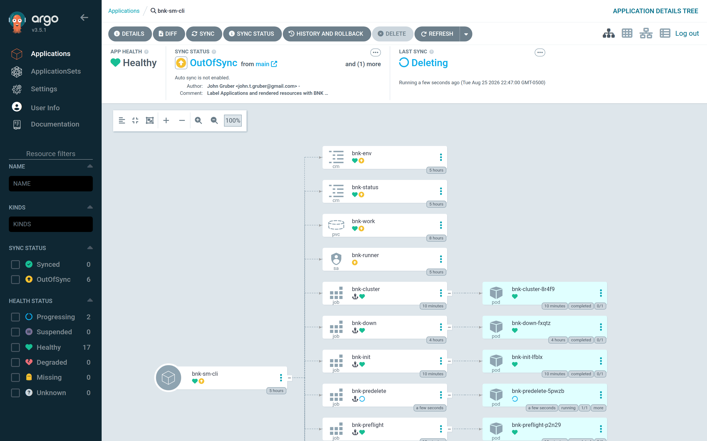

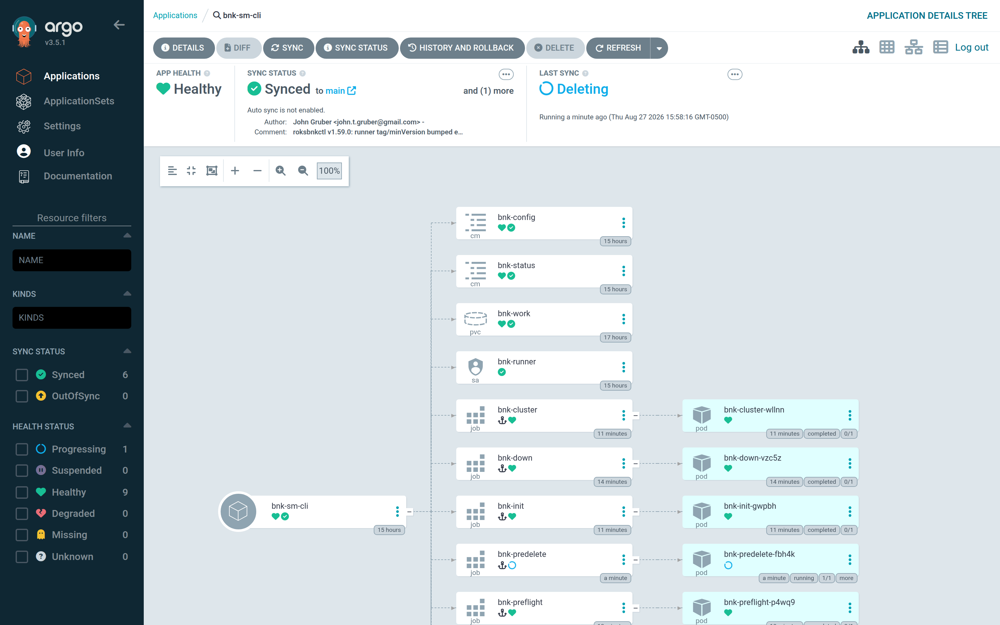

Open **bnk-predelete → Logs** to follow the destroy. This is the one log that
does not survive: Argo CD deletes the hook Job together with the Application,
so read it while it runs, or save it — `kubectl -n bnk-sm-cli logs -f
job/bnk-predelete` — before it is gone.

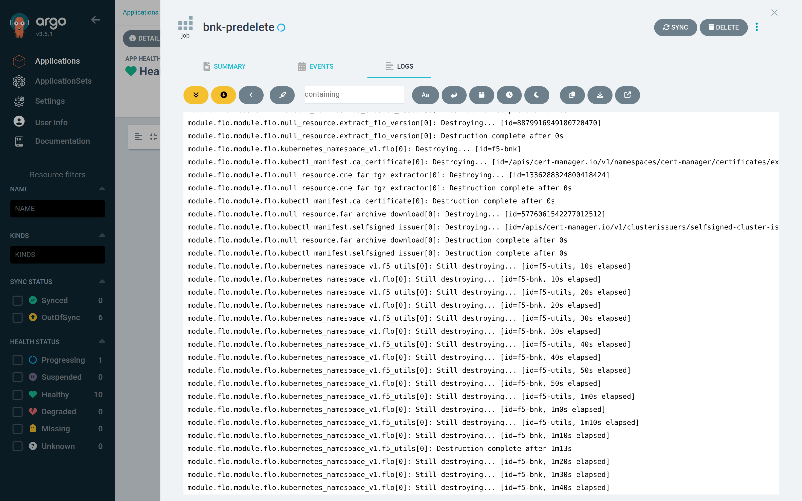

```text
Plan: 0 to add, 0 to change, 37 to destroy.
module.cne_instance.module.cneinstance.null_resource.validation_webhook_ready[0]: Destruction complete after 0s
module.license.module.license.null_resource.cneinstance_available_24[0]: Destruction complete after 0s
module.license.module.license.null_resource.license_active[0]: Destruction complete after 1s
module.testing.null_resource.roks_cluster_gate: Destruction complete after 1s
module.license.module.license.kubectl_manifest.bnk_license[0]: Destruction complete after 0s
module.cne_instance.module.cneinstance.kubectl_manifest.cneinstance_scc_policies["f5-bnk/flo-f5-lifecycle-operator"]: Destruction complete after 0s
Error: context deadline exceeded
  ⚠ namespace "f5-bnk" was stuck Terminating; cleared F5 finalizers on 2 object(s) and it drained.
→ terraform destroy (retry, after freeing the stuck namespace)
Plan: 0 to add, 0 to change, 5 to destroy.
Destroy complete! Resources: 5 destroyed.
✓ BNK phase destroyed. Cluster phase /work/.roksbnkctl/sm-cli/state-cluster/ is intact.
```

The same destroy as Option A — here it ran as the PreDelete hook, took about four and a half minutes on `sm-cli`, and included roksbnkctl's stuck-namespace recovery.

When the hook completes, Argo CD deletes the managed resources — the hook Jobs,
the ConfigMaps, the ServiceAccount and RBAC — skipping the PVC (`Delete=false`),
and finally the Application itself. The list is empty again:

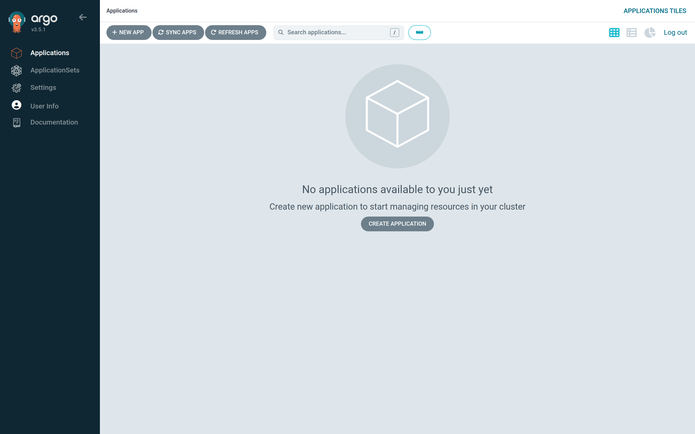

What is left in the namespace is exactly the PVC and the out-of-band Secret:

```text
persistentvolumeclaim/bnk-work   Bound   …   8Gi   RWO   local-path
secret/bnk-secrets               Opaque  1
```

Re-creating the Application later (`kubectl apply -f apps/sm-cli-application.yaml`)
and syncing finds the workspace on the PVC and installs again. From the CLI the
whole delete is:

```bash
argocd app delete bnk-sm-cli            # foreground cascade → PreDelete hook → resources
```

## Which one to use

- Tearing BNK down to re-install it, upgrade it, or change a create-time
  setting: **Option A**. The Application stays as the record of what was done.
- Decommissioning the workspace: **Option A, then Option B** — you get the
  destroy log, and then the namespace is cleaned up.
- A cluster you built from Git (`bnk-small`, `bnk-medium`, `bnk-large`):
  **Option B** with `teardown.cluster: true` removes BNK, the cluster, its
  gateway connection and VPC in one PreDelete hook.

## What is left behind, on purpose

- The `bnk-work` PVC with the workspace and its `terraform.applied.tfvars`
  snapshot (roksbnkctl keeps the snapshot after a destroy, so a later
  `bnk up` can detect a line change).
- BNK's CustomResourceDefinitions on the cluster.
- The COS supply-chain bucket and the registry COS instance.
