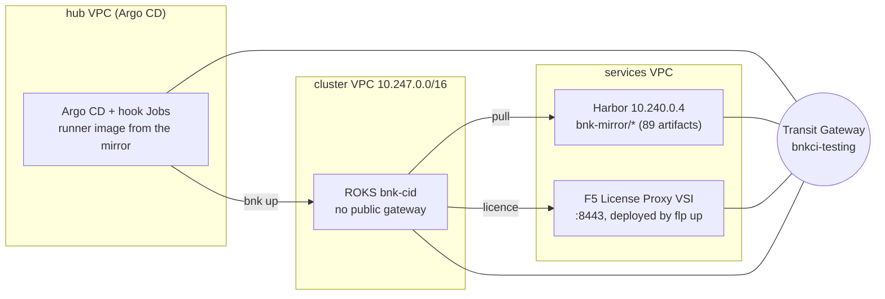

# Appendix B — Private registry and F5 License Proxy

A disconnected cluster changes two things about a workspace: where the images
and charts come from, and how BNK gets its licence. This appendix shows both in
one overlay — a private registry (a Harbor on the Transit Gateway) and an F5
License Proxy that the same workspace deploys before it installs BNK.

## The shape



- The mirror was populated once with `roksbnkctl registry replicate` from a
  host that can reach F5's registry; the workspace **adopts** it.
- The proxy is deployed by the workspace itself (`flp up`, as a VSI in its own
  small VPC on the gateway). Its endpoint and root CA land in the workspace as
  `flp-outputs.json`, and `bnk up` uses them for the licence hand-off — nothing
  to copy between workspaces.
- The cluster's nodes never leave the fabric: images from the mirror, licence
  from the proxy, and roksbnkctl installs the mirror's CA on every node before
  the first pull.

## The overlay

`apps/overlays/bnkdisco/values.yaml`:

```yaml
workspace: bnkdisco
namespace: bnk-bnkdisco
lifecycle: up
topology: hub
sizing:
  profile: small
runner:
  image: 10.240.0.4/bnk-mirror/roksbnkctl-tools-runner   # the runner, mirrored
  tag: v1.55.1
  runAsUser: 1000
  imagePullSecrets:
    - name: mirror-pull                  # only if the mirror project is not anonymous-pull
storage:
  storageClassName: local-path
secrets:
  mode: existing                         # bnk-secrets: IBMCLOUD_API_KEY + ROKSBNKCTL_GENERIC_PASSWORD
flp:
  deploy: true                           # flp up runs before bnk up; bnk up consumes its hand-off

config:
  ibmcloud:
    region: us-east
    resource_group: default
  prefix: bnk-cid
  tf_source:
    type: embedded
  cluster:
    create: false
    name: bnk-cid
    openshift_version: "4.21"
    network_mode: single-nic
  resources:
    transit_gateway:
      create: false
      existing: bnkci-testing            # the gateway the cluster, the mirror and the proxy share
  registry:                              # the private registry
    target: generic
    generic_host: 10.240.0.4
    generic_repo_prefix: bnk-mirror
    generic_username: admin
    generic_ca_b64: LS0tLS1CRUdJTiBDRVJUSUZJQ0FURS0tLS0t…   # the mirror's CA (PEM, base64)
    generic_ca_sha256: sha256:ab12…
  bnk:
    manifest_version: 2.4.0-EA
    far_auth_file: f5-far-auth-key.tgz
    subscription_jwt_file: subscription.jwt
    license_mode: f5licenseproxy
    flp:                                 # the F5 License Proxy this workspace deploys
      mode: vsi
      vsi:
        create_vpc: true
        vpc_name: bnk-cid-flp-vpc
        subnet_cidr: 10.248.0.0/24       # must not overlap anything on the gateway
        zone: us-east-1
        profile: bx2-4x16
        ssh_key: bnk-hub-key
        floating_ip: false               # reachable over the gateway only
        licensing_allowed_cidrs: [10.247.0.0/16]   # the cluster VPC
        management_allowed_cidrs: [10.250.0.0/24]  # the hub
  cos:
    instance: bnk-supply-chain
    bucket: bnk-supply-chain
    region: us-south
```

What each part does:

| | |
|---|---|
| `config.registry` | Names the mirror. Because it is present, the chart renders the `bnk-registry` hook, which runs `registry adopt` and records the mirror (`registry-mirror.json`) that `bnk up`'s guard requires. `generic_ca_b64` is the mirror's CA; `bnk up` installs it on every node and probes the registry from each before pulling. The password is `ROKSBNKCTL_GENERIC_PASSWORD` in `bnk-secrets`. |
| `runner.image` / `imagePullSecrets` | The hub pulls the runner from the mirror too. Mirror it with the rest of the BOM (`registry replicate` covers the runner when asked), and add a pull Secret in the workspace namespace if the mirror project is private. |
| `config.bnk.license_mode: f5licenseproxy` | BNK licenses through the proxy instead of F5's cloud. |
| `config.bnk.flp` + `flp.deploy: true` | The workspace deploys the proxy: a `bx2-4x16` VSI in a new `/24` VPC attached to the same gateway, licensing port open to the cluster VPC, management port to the hub. The `bnk-flp` hook runs `flp up --auto` at wave −3 and writes `flp-outputs.json`; `bnk up` reads it. `flp.mode: helm` deploys the proxy into the cluster instead. |
| `resources.transit_gateway.existing` | Everything is on one gateway: the hub, the mirror, the proxy and the cluster. Their prefixes — `10.250/24`, the services VPC, `10.248/24`, `10.247/16` — must not overlap. |

## Secrets for this workspace

```bash
kubectl create namespace bnk-bnkdisco
printf '%s' "$IBMCLOUD_API_KEY"         | kubectl -n bnk-bnkdisco create secret generic bnk-secrets \
  --from-file=IBMCLOUD_API_KEY=/dev/stdin
kubectl -n bnk-bnkdisco patch secret bnk-secrets -p "{\"stringData\":{\"ROKSBNKCTL_GENERIC_PASSWORD\":\"$HARBOR_PASSWORD\"}}"
kubectl -n bnk-bnkdisco create secret docker-registry mirror-pull \
  --docker-server=10.240.0.4 --docker-username=admin --docker-password="$HARBOR_PASSWORD"
```

## What the sync runs

```text
Sync  wave -4  bnk-init        seed the workspace from config.yaml · doctor
Sync  wave -3  bnk-cluster     cluster register bnk-cid · kubeconfig --download
Sync  wave -3  bnk-flp         flp up --auto  → VSI, proxy, flp-outputs.json
Sync  wave -2  bnk-registry    registry adopt → registry-mirror.json
Sync  wave -1  bnk-preflight   mirror record complete · FLP hand-off present
Sync  wave  0  bnk-up          bnk up --auto: CA DaemonSet → cert-manager → FLO → CNEInstance → License (proxy)
```

`bnk-preflight` checks the two things this topology adds: that the mirror
record is complete (`missing_count: 0`) and that the proxy hand-off exists.

## A proxy shared by several clusters

If one proxy serves several workspaces, deploy it in its own workspace
(`flp.deploy: true`, no BNK) and point the others at it instead of deploying
their own:

```yaml
config:
  bnk:
    license_mode: f5licenseproxy
    flp:
      external:
        url: https://10.248.0.4:8443
        root_ca_b64: LS0tLS1CRUdJTiBDRVJUSUZJQ0FURS0tLS0t…
```

`root_ca_b64` is public data (the proxy's CA certificate), so it can live in
the overlay.

## Teardown

`lifecycle: down` or deleting the Application runs `bnk down` and then — for
a proxy this workspace deployed — `flp down` (`teardown.flp: true`). The
mirror is never touched: it belongs to the estate, not to the workspace.
