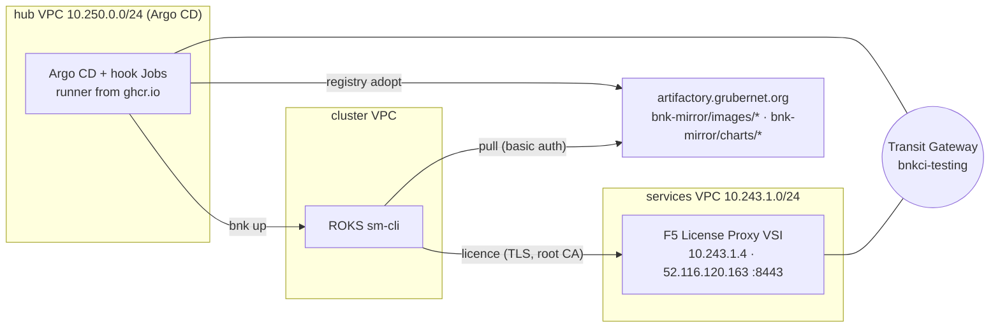
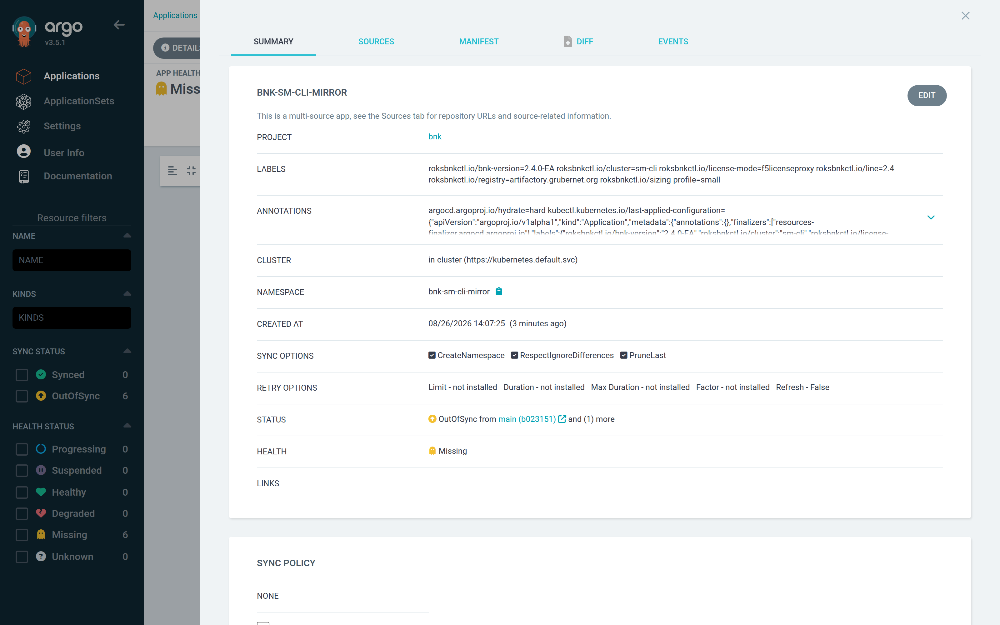
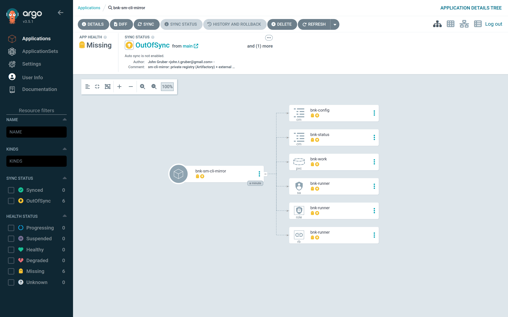
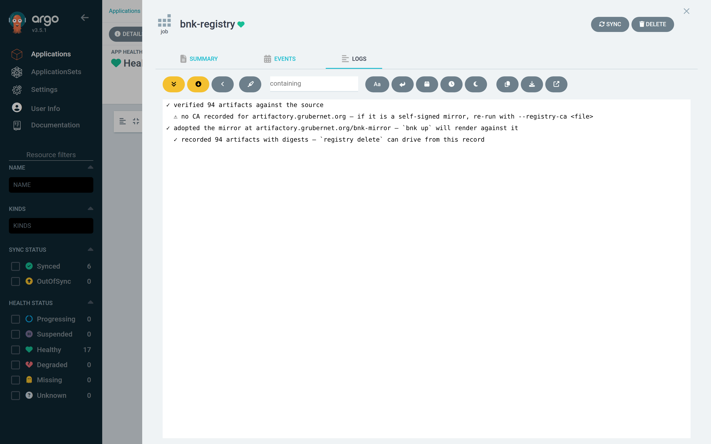
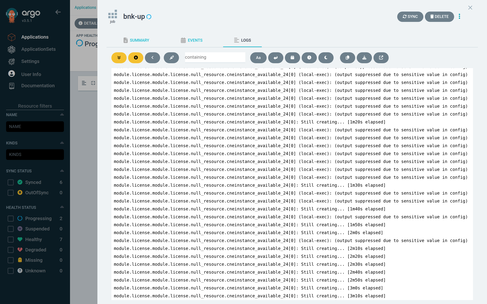
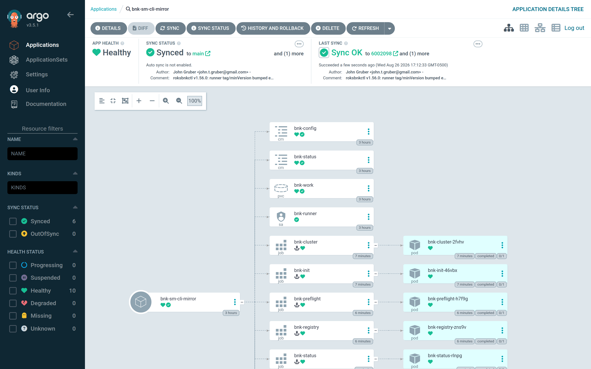
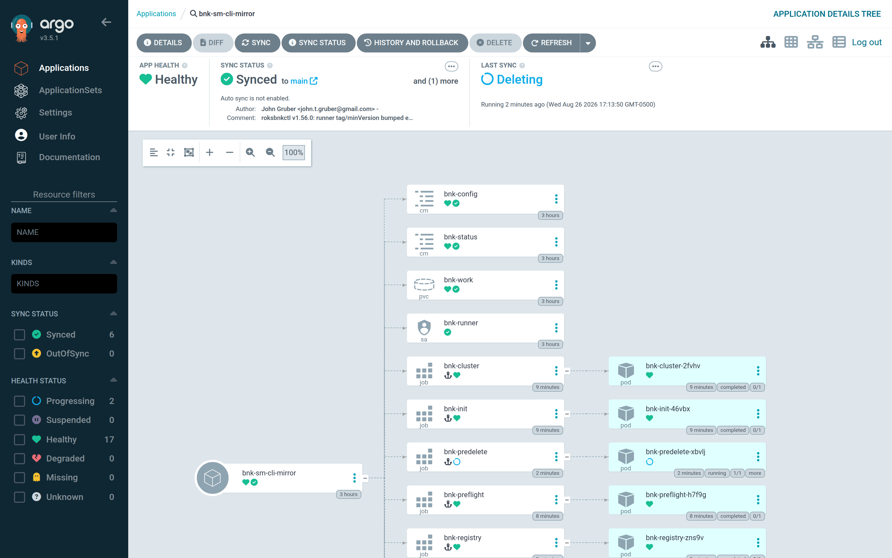
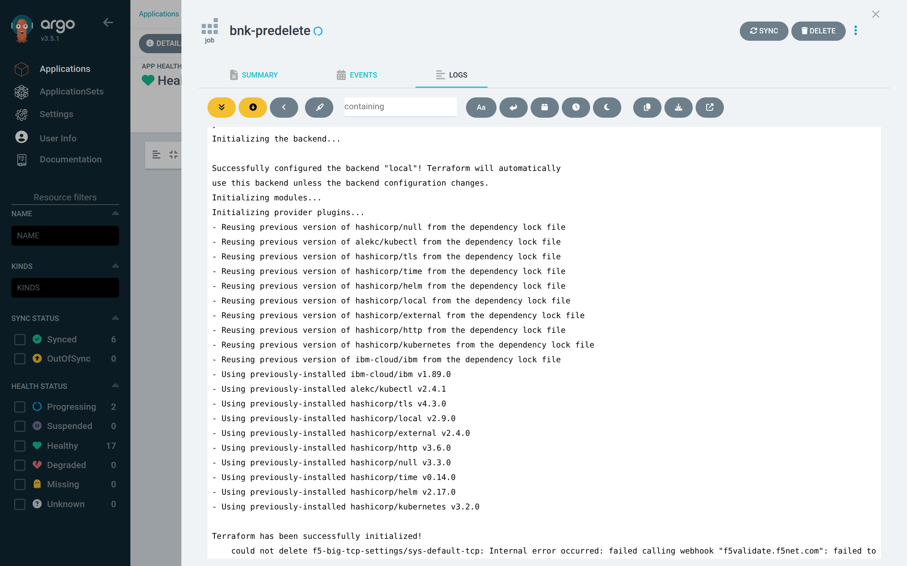

# Appendix B — Private registry and F5 License Proxy

Two things change when BNK must not pull from F5 directly: where the images and
charts come from, and how BNK gets its licence. This appendix installs BNK 2.4
on the same `sm-cli` cluster as Part II, but from a **private registry** (an
Artifactory with the 2.4.0-EA artifacts mirrored) and licensed through an
**F5 License Proxy** that lives outside the cluster. The workspace is
`apps/overlays/sm-cli-mirror/values.yaml`; everything below was captured from
that Application.

## The shape



- The mirror was populated once, as a supply-chain step, with
  `roksbnkctl registry replicate` from a host that can reach F5's registry.
  It holds the 2.4.0-EA bill of materials in roksbnkctl's layout —
  `bnk-mirror/images/<name>` and `bnk-mirror/charts/<name>` — behind a
  publicly-trusted certificate and a user/token.
- The proxy already exists — it is estate, deployed with roksbnkctl outside
  Argo CD. Argo CD never deploys a proxy: the workspace only needs its
  **endpoint** and **root CA**, and gets them from `config.bnk.flp.external`.
- `bnk up` renders every chart and image reference against the mirror and
  points the BNK `License` resource at the proxy. The cluster never talks to
  `repo.f5.com` or to F5's licensing service.

## The overlay

`apps/overlays/sm-cli-mirror/values.yaml`:

```yaml
# sm-cli-mirror — the same ROKS 4.21 cluster as sm-cli, installed from a
# private registry instead of F5's (an Artifactory at artifactory.grubernet.org
# with the BNK 2.4.0-EA artifacts mirrored under bnk-mirror/) and licensed
# through an F5 License Proxy that another workspace deployed. The cluster
# reaches the proxy on its public address; the hub reaches it over the
# transit gateway. BNK 2.4 "Small cluster" profile.
workspace: sm-cli-mirror
namespace: bnk-sm-cli-mirror
lifecycle: up
topology: hub
sizing:
  profile: small               # → workers_per_zone=2, worker_flavor=bx2.8x32, tmm_replicas=3, cneinstance_size=Tiny
runner:
  tag: v1.56.0
  runAsUser: 1000              # k3s hub, not OpenShift — pin the runner's uid
  resources:
    requests: {cpu: 250m, memory: 512Mi}
    limits: {cpu: "2", memory: 3Gi}
storage:
  size: 8Gi
  storageClassName: local-path # k3s default on the hub VSI
secrets:
  mode: existing               # bnk-secrets: IBMCLOUD_API_KEY + ROKSBNKCTL_GENERIC_PASSWORD (the registry token)
registry:
  adoptArgs: --verify-contents # build the 2.4.0-EA bill of materials from the F5 source and digest-check
                               # every artifact in the mirror before recording it (the hook can reach
                               # repo.f5.com; leave empty when it cannot — adopt then records the mirror
                               # as configured, with a ⚠ that Artifactory's registry-wide catalogue is empty)

config:                        # roksbnkctl config.yaml
  ibmcloud:
    region: us-east
    resource_group: default
  prefix: sm-cli
  tf_source:
    type: embedded
  cluster:
    create: false              # attach to the existing cluster (cluster register)
    name: sm-cli
    openshift_version: "4.21"
    network_mode: single-nic
  resources:
    transit_gateway:
      create: false
      existing: sm-cli-tgw     # the gateway the cluster VPC is already on
  registry:                    # the private registry — populated once with registry replicate, adopted here
    target: generic
    generic_host: artifactory.grubernet.org
    generic_repo_prefix: bnk-mirror
    generic_username: admin    # password = ROKSBNKCTL_GENERIC_PASSWORD in bnk-secrets
                               # no generic_ca_b64: the registry's certificate is publicly trusted
  bnk:
    manifest_version: 2.4.0-EA
    far_repo_url: repo.f5.com  # only used by registry adopt --verify-contents (the BOM comes from the source)
    far_auth_file: non-ga-prod-pull-key.tgz
    subscription_jwt_file: subscription.jwt
    license_mode: f5licenseproxy
    flp:
      external:                # a proxy deployed elsewhere: endpoint + its root CA (public data)
        url: https://52.116.120.163:8443
        root_ca_b64: LS0tLS1CRUdJTiBDRVJUSUZJQ0FURS0tLS0tCk1JSUJ…   # the proxy's CA, base64 PEM (772 chars)
  cos:
    instance: bnk-supply-chain
    bucket: bnk-artifacts-0b5a00334eaf
    region: us-south

timeouts:
  init: 600
  cluster: 1800
  registry: 1800
  preflight: 900
  apply: 7200
  status: 300
  down: 5400
```

What each part does:

| | |
|---|---|
| `config.registry` | Names the mirror: host, repository prefix and user. Because it is present, the chart renders the `bnk-registry` hook, which runs `registry adopt` and records the mirror (`registry-mirror.json`) that `bnk up`'s guard requires. The password is `ROKSBNKCTL_GENERIC_PASSWORD` in `bnk-secrets`. There is no `generic_ca_b64` because the certificate is publicly trusted; a self-signed mirror adds its CA there (and `generic_ca_sha256` as the pin) and `bnk up` installs it on every node before the first pull. |
| `registry.adoptArgs: --verify-contents` | `registry adopt` builds the 2.4.0-EA bill of materials from the F5 source and digest-checks every one of its 94 artifacts in the mirror before recording it — proof, not assertion, that the mirror is complete for this version. It needs `repo.f5.com` reachable from the hook Job (true on this hub). Leave it empty when it is not: adopt then records the mirror as configured, with a ⚠ that it could not list Artifactory's registry-wide catalogue (Artifactory answers `/v2/_catalog` with an empty response; a Harbor or Docker registry answers it and adopt reports how many repositories it found under the prefix). |
| `config.bnk.license_mode: f5licenseproxy` | BNK licenses through the proxy instead of F5's cloud. |
| `config.bnk.flp.external` | The proxy's URL and root CA (base64 PEM). The CA is public data, so it lives in the overlay; the preflight gate refuses to run `bnk up` without both. |
| `config.bnk.far_*` | Still named: `registry adopt --verify-contents` and `registry replicate` build the bill of materials from the F5 source, and the subscription is part of the licence. Neither is contacted by the cluster. |
| `secrets.mode: existing` | `bnk-secrets` carries two keys here — the IBM Cloud API key and the registry token. |

The Application is `apps/sm-cli-mirror-application.yaml` — the Part II
Application with a different name, overlay and two extra labels
(`roksbnkctl.io/registry`, `roksbnkctl.io/license-mode`) so the list view says
where this BNK pulls from and how it licenses.



## Reaching the proxy

The cluster's nodes must reach the proxy on **:8443**, and the proxy's
certificate must name the address they use. Here the hub is on the same
Transit Gateway as the proxy and uses its private address; the cluster's VPC is
on a different gateway (its prefixes overlap another VPC on `bnkci-testing`),
so it uses the proxy's public address, which is in the certificate's SAN, and
the proxy's security group allows :8443 from the cluster's three public-gateway
addresses only. Whichever path you use, check it from the hub before you sync —
the same check `bnk up` will effectively make from every node:

```bash
base64 -d <<<"$ROOT_CA_B64" > flp-ca.pem
curl --cacert flp-ca.pem https://52.116.120.163:8443/     # 400 {"message":"no matching operation was found"} = TLS ok
```

A `400` is the right answer: the proxy has no operation at `/`, but the TLS
handshake verified against the root CA, which is all the licence helper needs.

## Secrets for this workspace

```bash
kubectl create namespace bnk-sm-cli-mirror
kubectl -n bnk-sm-cli-mirror create secret generic bnk-secrets \
  --from-file=IBMCLOUD_API_KEY=<(printf '%s' "$IBMCLOUD_API_KEY") \
  --from-file=ROKSBNKCTL_GENERIC_PASSWORD=<(printf '%s' "$ARTIFACTORY_TOKEN")
```

`printf '%s'` matters: a trailing newline in either value is sent as part of
the credential.

## What the sync runs



```text
Sync  wave -4  bnk-init        seed the workspace from config.yaml · doctor
Sync  wave -3  bnk-cluster     cluster register sm-cli · kubeconfig --download
Sync  wave -2  bnk-registry    registry adopt --verify-contents → registry-mirror.json
Sync  wave -1  bnk-preflight   mirror record complete · FLP hand-off present
Sync  wave  0  bnk-up          bnk up --auto against the mirror, licence via the proxy
PostSync       bnk-status      bnk status → bnk-status ConfigMap
```

### bnk-registry



```text
  ✓ recorded 94 artifacts with digests — `registry delete` can drive from this record
  …
  ✓ recorded 94 artifacts with digests — `registry delete` can drive from this record
✓ verified 94 artifacts against the source
  ⚠ no CA recorded for artifactory.grubernet.org — if it is a self-signed mirror, re-run with --registry-ca <file>
✓ adopted the mirror at artifactory.grubernet.org/bnk-mirror — `bnk up` will render against it
```

`--verify-contents` built the 2.4.0-EA bill of materials from `repo.f5.com`
and compared the digest of every artifact in the mirror with its source: 94 of
94 match. The one warning is expected for a publicly-trusted certificate —
there is no private CA to record. The record is written and `bnk up` will
render against `artifactory.grubernet.org/bnk-mirror`.

### bnk-preflight

```text
preflight: FLP hand-off present (config.bnk.flp.external)
preflight: ok (deployed=false)
```

### bnk-up



The lines that differ from a Part II install:

```text
→ FLP licensing: BNK will license via the F5 License Proxy — bnk.flp.external (a proxy in another cluster).
…
→ no registry CA recorded for artifactory.grubernet.org — assuming it is already trusted; checking reachability from every node
  each target is retried for up to 180s before it is called unreachable (bnk.preflight.reachability_retry_seconds)
  F5-License-Proxy: 6/6 nodes reachable
    ✓ kube-…-000001c3 -> F5-License-Proxy (52.116.120.163:8443): dns=skipped-ip tcp=ok
  registry: 6/6 nodes reachable
    ✓ kube-…-000001c3 -> registry (artifactory.grubernet.org:443): dns=ok tcp=ok
✓ artifactory.grubernet.org reachable from every node
…
              licenseProxyServerRootCaPath: /etc/cm20/licenseserver-rootca/licenseserver-rootca.txt
              operationMode: f5licenseproxy
              teemEntitlementUrl: https://52.116.120.163:8443/license-proxy/v1
…
Plan: 41 to add, 0 to change, 0 to destroy.
Apply complete! Resources: 41 added, 0 changed, 0 destroyed.
[status] succeeded deployed=true — bnk up completed
```

Two reachability probes run from every node before Terraform starts — one to
the registry, one to the proxy — because "unreachable" is the failure that
otherwise surfaces twenty minutes later as an `ImagePullBackOff`. On the first
install the probe DaemonSet is created fresh and reports within seconds; on a
re-sync it already exists and is rolled one node at a time, so the line sits
with nothing under it for two to three minutes on a six-node cluster before all
six report. That pause is the rolling update, not a timeout — a node that
really cannot reach the target is retried for 180 s and then named. The `License`
resource carries `operationMode: f5licenseproxy`, the proxy URL and the path
where the licence helper finds the root CA that `bnk up` mounted.

The proof is on the cluster. Every image BNK runs came from the mirror — all
27 of them, cert-manager's included:

```text
$ kubectl get pods -A -o jsonpath='{range .items[*]}{range .spec.containers[*]}{.image}{"\n"}{end}{end}' | sort -u
artifactory.grubernet.org/bnk-mirror/images/crd-conversion:v1.291.23
artifactory.grubernet.org/bnk-mirror/images/crd-installer:v14.91.12-0.1.66
artifactory.grubernet.org/bnk-mirror/images/crdupdater:v0.90.14-0.0.2
artifactory.grubernet.org/bnk-mirror/images/f5-blobd:v1.25.5-0.0.2
artifactory.grubernet.org/bnk-mirror/images/f5-cert-client:v3.9.5-0.0.2
artifactory.grubernet.org/bnk-mirror/images/f5-coremond:v0.25.13-0.0.2
…
artifactory.grubernet.org/bnk-mirror/images/tmm-img:v10.204.15-0.0.45
artifactory.grubernet.org/bnk-mirror/jetstack/cert-manager-cainjector:v1.17.3
artifactory.grubernet.org/bnk-mirror/jetstack/cert-manager-controller:v1.17.3
artifactory.grubernet.org/bnk-mirror/jetstack/cert-manager-webhook:v1.17.3
```

and the licence was granted through the proxy:

```text
$ kubectl get license -n f5-utils
NAME          STATE    MODE             ENTITLEMENT   ENVIRONMENT   EXPIRY                 AGE
bnk-license   Active   f5licenseproxy   eval          test          2026-09-25T19:22:04Z   4m27s
```

`bnk-status` then reports what Part II's did: `probe.cneinstance: Available=True`,
`probe.flo: 1/1 ready`, `probe.cert-manager: 3/3 ready`.



## Teardown

Exactly as in Part IV — set `lifecycle: down` and sync, or delete the
Application. This one was deleted from the UI: **Delete**, type the name,
**OK**, and the `bnk-predelete` hook runs `bnk down --auto` before Argo CD
removes anything else.





```text
→ FLP licensing: BNK will license via the F5 License Proxy — bnk.flp.external (a proxy in another cluster).
→ terraform destroy
…
Plan: 0 to add, 0 to change, 40 to destroy.
module.cne_instance.module.cneinstance.kubectl_manifest.cneinstance[0]: Destroying...
module.flo.module.flo.kubernetes_secret_v1.mirror_secret_flo[0]: Destroying...
module.flo.module.flo.kubectl_manifest.cnemanifest[0]: Destroying...
module.flo.module.flo.ibm_iam_trusted_profile.cne_controller[0]: Destroying...
…
Error: context deadline exceeded
  ⚠ namespace "f5-bnk" was stuck Terminating; cleared F5 finalizers on 2 object(s) and it drained.
→ terraform destroy (retry, after freeing the stuck namespace)
Plan: 0 to add, 0 to change, 5 to destroy.
module.cert_manager.module.cert_manager.helm_release.cert_manager[0]: Destroying...
…
```

Forty resources this time rather than Part II's thirty-seven: the three extra
are the `mirror-secret` pull Secrets `bnk up` placed in `f5-bnk`, `f5-utils`
and `kube-system`. The `f5-bnk` namespace stall and its repair are the same as
in Part IV. Sixteen minutes after **OK** the Application is gone; the cluster
keeps only the F5 CRDs (deliberately) and the empty `roksbnkctl-registry-trust`
namespace the probe ran in. The mirror and the proxy are estate, not part of
the workspace — neither is touched — and the workspace's PVC stays on the hub
with the registry record for the next `bnk up`.


